# SpringBoot 原理

## 1. 配置优先级

SpringBoot 项目当中支持的三类配置文件：

- application.properties
- application.yml
- application.yaml

properties、yaml、yml 三种配置文件同时存在

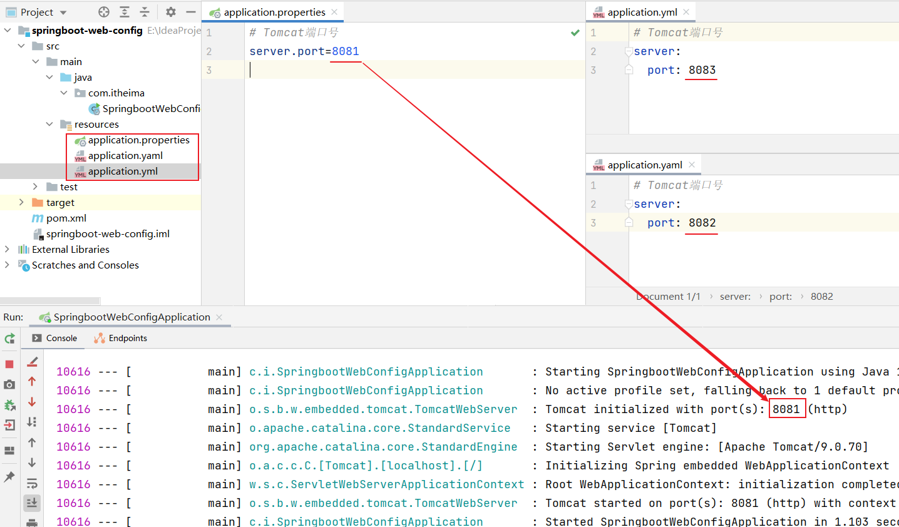

> properties、yaml、yml 三种配置文件，优先级最高的是 properties

yaml、yml 两种配置文件同时存在

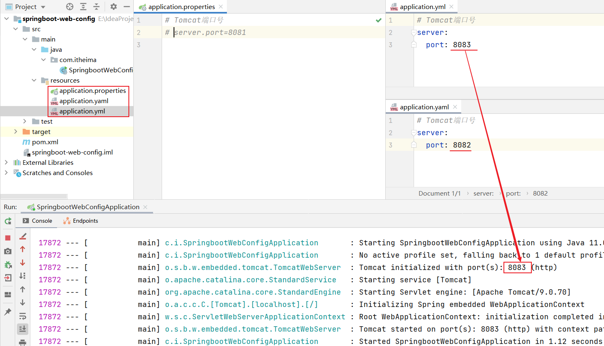

> 配置文件优先级排名（从高到低）：
>
> 1. properties 配置文件
> 2. yml 配置文件（主流）
> 3. yaml 配置文件

在 SpringBoot 为了增强程序的扩展性，还支持另外两种常见的配置方式：

1. Java 系统属性配置 （格式： -Dkey=value）

   ```shell
   -Dserver.port=9000
   ```

2. 命令行参数 （格式：--key=value）

   ```shell
   --server.port=10010
   ```

如何来指定 Java 系统属性和命令行参数呢？

- 编辑启动程序的配置信息

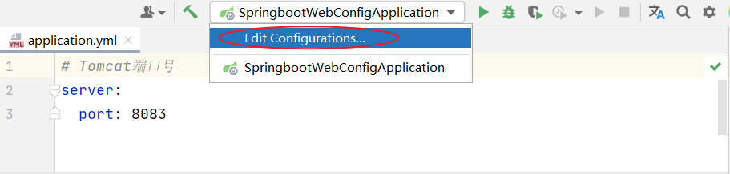

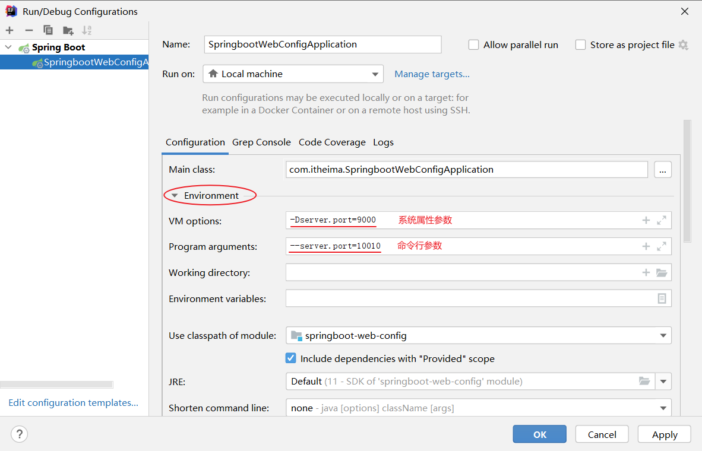

重启服务，同时配置 Tomcat 端口(三种配置文件、系统属性、命令行参数)，测试哪个 Tomcat 端口号生效：

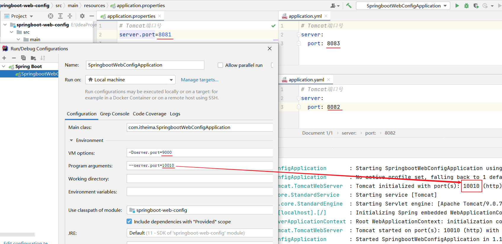

删除命令行参数配置，重启 SpringBoot 服务：

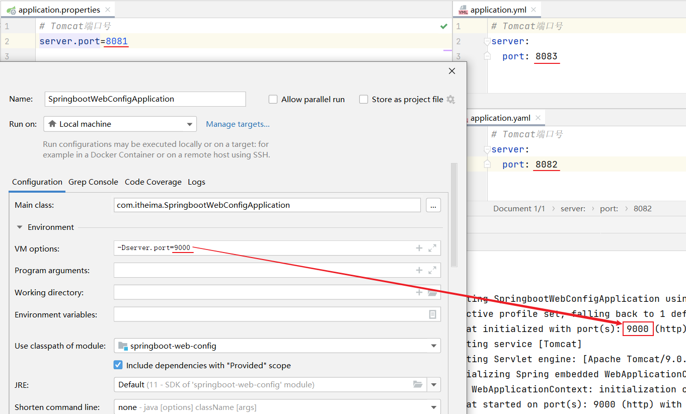

> 优先级： 命令行参数 > 系统属性参数 > properties 参数 > yml 参数 > yaml 参数

思考：如果项目已经打包上线了，如何来设置 Java 系统属性和命令行参数呢？

```shell
java -Dserver.port=9000 -jar XXXXX.jar --server.port=10010
```

演示打包程序运行时指定 Java 系统属性和命令行参数：

1. 执行 maven 打包指令 package，把项目打成 jar 文件
2. 使用命令：java -jar 方式运行 jar 文件程序

项目打包：

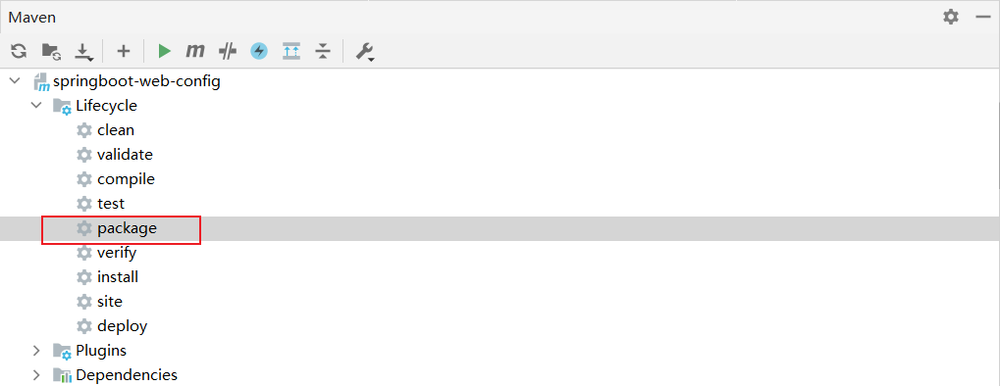

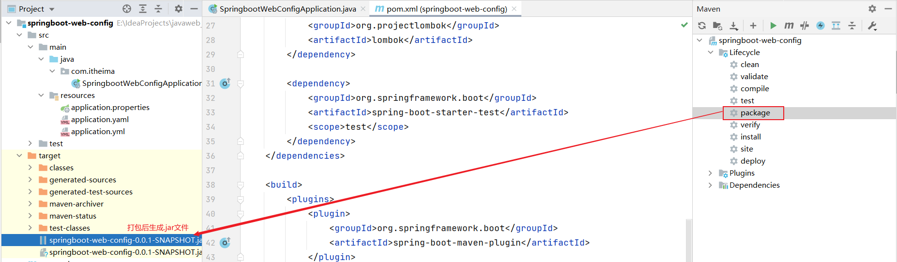

运行 jar 程序：

- 同时设置 Java 系统属性和命令行参数

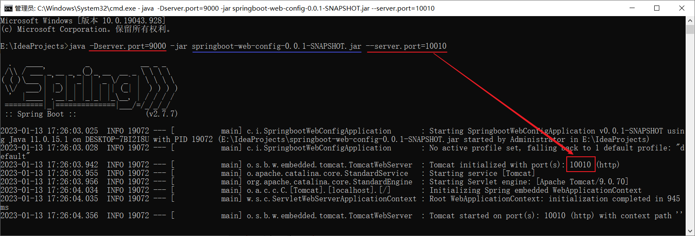

- 仅设置 Java 系统属性

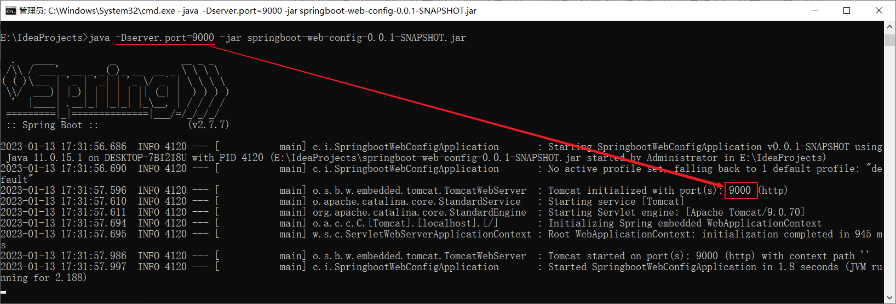

> 注意事项：
>
> - Springboot 项目进行打包时，需要引入插件 spring-boot-maven-plugin (基于官网骨架创建项目，会自动添加该插件)

## 2. Bean 管理

Spring 中的注解 @Component 以及三个衍生注解（@Controller、@Service、@Repository）来声明 IOC 容器中的 bean 对象

### 2.1 获取 Bean

默认情况下，SpringBoot 项目在启动的时候会自动的创建 IOC 容器(也称为 Spring 容器)，并且在启动的过程当中会自动的将 bean 对象都创建好，存放在 IOC 容器当中。应用程序在运行时需要依赖什么 bean 对象，就直接进行依赖注入就可以了。

在 Spring 容器中提供了一些方法，可以主动从 IOC 容器中获取到 bean 对象，下面介绍 3 种常用方式：

1. 根据 name 获取 bean

   ```java
   Object getBean(String name)
   ```

2. 根据类型获取 bean

   ```java
   <T> T getBean(Class<T> requiredType)
   ```

3. 根据 name 获取 bean（带类型转换）

   ```java
   <T> T getBean(String name, Class<T> requiredType)
   ```

思考：要从 IOC 容器当中来获取到 bean 对象，需要先拿到 IOC 容器对象，怎么样才能拿到 IOC 容器呢？

- 想获取到 IOC 容器，直接将 IOC 容器对象注入进来就可以了

控制器：DeptController

```java
@RestController
@RequestMapping("/depts")
public class DeptController {

    @Autowired
    private DeptService deptService;

    public DeptController(){
        System.out.println("DeptController constructor ....");
    }

    @GetMapping
    public Result list(){
        List<Dept> deptList = deptService.list();
        return Result.success(deptList);
    }

    @DeleteMapping("/{id}")
    public Result delete(@PathVariable Integer id)  {
        deptService.delete(id);
        return Result.success();
    }

    @PostMapping
    public Result save(@RequestBody Dept dept){
        deptService.save(dept);
        return Result.success();
    }
}
```

业务实现类：DeptServiceImpl

```java
@Slf4j
@Service
public class DeptServiceImpl implements DeptService {
    @Autowired
    private DeptMapper deptMapper;

    @Override
    public List<Dept> list() {
        List<Dept> deptList = deptMapper.list();
        return deptList;
    }

    @Override
    public void delete(Integer id) {
        deptMapper.delete(id);
    }

    @Override
    public void save(Dept dept) {
        dept.setCreateTime(LocalDateTime.now());
        dept.setUpdateTime(LocalDateTime.now());
        deptMapper.save(dept);
    }
}
```

Mapper 接口：

```java
@Mapper
public interface DeptMapper {
    //查询全部部门数据
    @Select("select * from dept")
    List<Dept> list();

    //删除部门
    @Delete("delete from dept where id = #{id}")
    void delete(Integer id);

    //新增部门
    @Insert("insert into dept(name, create_time, update_time) values (#{name},#{createTime},#{updateTime})")
    void save(Dept dept);
}

```

测试类：

```java
@SpringBootTest
class SpringbootWebConfig2ApplicationTests {

    @Autowired
    private ApplicationContext applicationContext; //IOC容器对象

    //获取bean对象
    @Test
    public void testGetBean(){
        //根据bean的名称获取
        DeptController bean1 = (DeptController) applicationContext.getBean("deptController");
        System.out.println(bean1);

        //根据bean的类型获取
        DeptController bean2 = applicationContext.getBean(DeptController.class);
        System.out.println(bean2);

        //根据bean的名称 及 类型获取
        DeptController bean3 = applicationContext.getBean("deptController", DeptController.class);
        System.out.println(bean3);
    }
}
```

程序运行后控制台日志：


> 问题：输出的 bean 对象地址值是一样的，说明 IOC 容器当中的 bean 对象有几个？
>
> 答案：只有一个。 （默认情况下，IOC 中的 bean 对象是单例）
>
> 能不能将 bean 对象设置为非单例的(每次获取的 bean 都是一个新对象)？
>
> 可以

注意事项：

- 上述所说的 【Spring 项目启动时，会把其中的 bean 都创建好】还会受到作用域及延迟初始化影响，这里主要针对于默认的单例非延迟加载的 bean 而言。

### 2.2 Bean 作用域

默认 bean 对象是单例模式(只有一个实例对象)。那么如何设置 bean 对象为非单例呢？需要设置 bean 的作用域。

在 Spring 中支持五种作用域，后三种在 web 环境才生效：

| **作用域**  | **说明**                                         |
| ----------- | ------------------------------------------------ |
| singleton   | 容器内同名称的 bean 只有一个实例（单例）（默认） |
| prototype   | 每次使用该 bean 时会创建新的实例（非单例）       |
| request     | 每个请求范围内会创建新的实例（web 环境中，了解） |
| session     | 每个会话范围内会创建新的实例（web 环境中，了解） |
| application | 每个应用范围内会创建新的实例（web 环境中，了解） |

- 借助 Spring 中的@Scope 注解来进行配置作用域

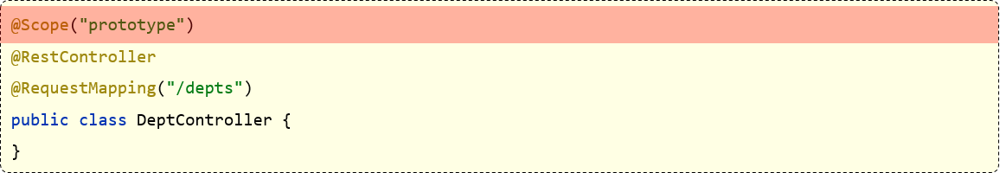

**测试一**:

- 控制器

```java
//默认bean的作用域为：singleton (单例)
@Lazy //延迟加载（第一次使用bean对象时，才会创建bean对象并交给ioc容器管理）
@RestController
@RequestMapping("/depts")
public class DeptController {

    @Autowired
    private DeptService deptService;

    public DeptController(){
        System.out.println("DeptController constructor ....");
    }

    //省略其他代码...
}
```

- 测试类

```java
@SpringBootTest
class SpringbootWebConfig2ApplicationTests {

    @Autowired
    private ApplicationContext applicationContext; //IOC容器对象

    //bean的作用域
    @Test
    public void testScope(){
        for (int i = 0; i < 10; i++) {
            DeptController deptController = applicationContext.getBean(DeptController.class);
            System.out.println(deptController);
        }
    }
}
```

重启 SpringBoot 服务，运行测试方法，查看控制台打印的日志：

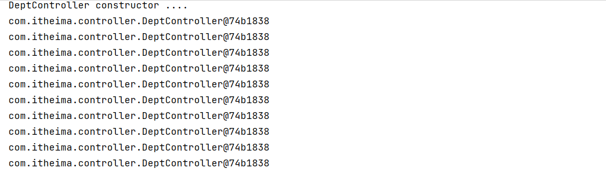

> 注意事项：
>
> - IOC 容器中的 bean 默认使用的作用域：singleton (单例)
>
> - 默认 singleton 的 bean，在容器启动时被创建，可以使用@Lazy 注解来延迟初始化(延迟到第一次使用时)

**测试二**:

修改控制器 DeptController 代码：

```java
@Scope("prototype") //bean作用域为非单例
@Lazy //延迟加载
@RestController
@RequestMapping("/depts")
public class DeptController {

    @Autowired
    private DeptService deptService;

    public DeptController(){
        System.out.println("DeptController constructor ....");
    }

    //省略其他代码...
}
```

重启 SpringBoot 服务，再次执行测试方法，查看控制台打印的日志：

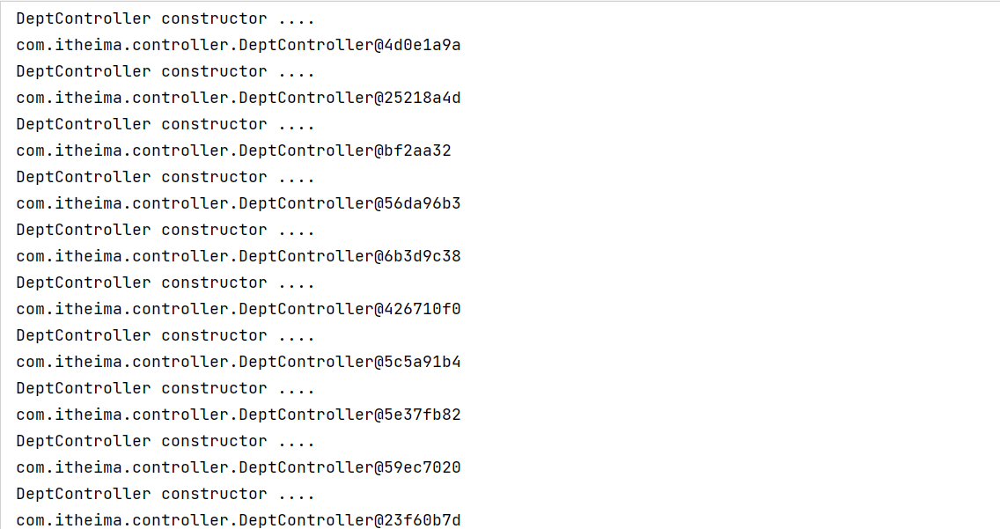

> 注意事项：
>
> - prototype 的 bean，每一次使用该 bean 的时候都会创建一个新的实例
> - 实际开发当中，绝大部分的 Bean 是单例的，也就是说绝大部分 Bean 不需要配置 scope 属性

### 2.3 第三方 Bean

像 controller、service，dao 三层体系下编写的类(自定义类)。要声明这些 bean，只需要在类上加上@Component 以及它的这三个衍生注解（@Controller、@Service、@Repository），就可以来声明这个 bean 对象了。  
但是在我们项目开发当中，还有一种情况就是这个类它不是我们自己编写的，而是我们引入的第三方依赖当中提供的。

在 pom.xml 文件中，引入 dom4j：

```xml
<!--Dom4j-->
<dependency>
    <groupId>org.dom4j</groupId>
    <artifactId>dom4j</artifactId>
    <version>2.1.3</version>
</dependency>
```

> dom4j 就是第三方组织提供的。 dom4j 中的 SAXReader 类就是第三方编写的。

需要使用到 SAXReader 对象时，直接进行依赖注入是不是就可以了呢？

- 按照之前的做法，需要在 SAXReader 类上添加一个注解@Component（将当前类交给 IOC 容器管理）

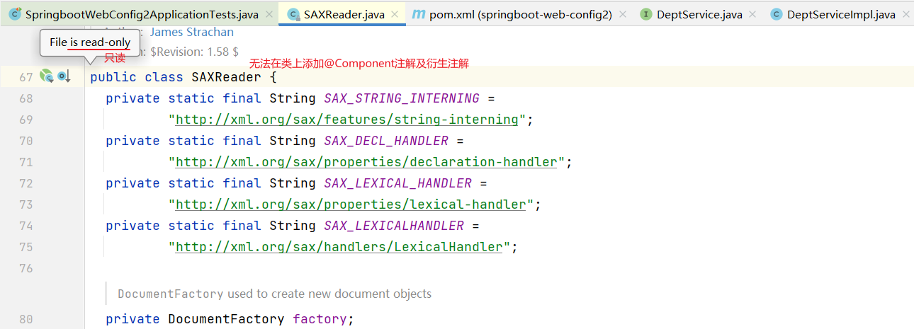

> 结论：第三方提供的类是只读的。无法在第三方类上添加@Component 注解或衍生注解。

那么我们应该怎样使用并定义第三方的 bean 呢？

- 如果要管理的 bean 对象来自于第三方（不是自定义的），是无法用@Component 及衍生注解声明 bean 的，就需要用到 **@Bean** 注解。

**解决方案 1：在启动类上添加@Bean 标识的方法**:

```java
@SpringBootApplication
public class SpringbootWebConfig2Application {

    public static void main(String[] args) {
        SpringApplication.run(SpringbootWebConfig2Application.class, args);
    }

    //声明第三方bean
    @Bean //将当前方法的返回值对象交给IOC容器管理, 成为IOC容器bean
    public SAXReader saxReader(){
        return new SAXReader();
    }
}

```

xml 文件：

```xml
<?xml version="1.0" encoding="UTF-8"?>
<emp>
    <name>Tom</name>
    <age>18</age>
</emp>

```

测试类：

```java
@SpringBootTest
class SpringbootWebConfig2ApplicationTests {

    @Autowired
    private SAXReader saxReader;

    //第三方bean的管理
    @Test
    public void testThirdBean() throws Exception {
        Document document = saxReader.read(this.getClass().getClassLoader().getResource("1.xml"));
        Element rootElement = document.getRootElement();
        String name = rootElement.element("name").getText();
        String age = rootElement.element("age").getText();

        System.out.println(name + " : " + age);
    }

    //省略其他代码...
}

```

重启 SpringBoot 服务，执行测试方法后，控制台输出日志：

```md
Tom : 18
```

> **说明：以上在启动类中声明第三方 Bean 的作法，不建议使用（项目中要保证启动类的纯粹性）**

**解决方案 2：在配置类中定义@Bean 标识的方法**:

- 如果需要定义第三方 Bean 时， 通常会单独定义一个配置类

```java
@Configuration //配置类  (在配置类当中对第三方bean进行集中的配置管理)
public class CommonConfig {

    //声明第三方bean
    @Bean //将当前方法的返回值对象交给IOC容器管理, 成为IOC容器bean
          //通过@Bean注解的name/value属性指定bean名称, 如果未指定, 默认是方法名
    public SAXReader reader(DeptService deptService){
        System.out.println(deptService);
        return new SAXReader();
    }

}

```

注释掉 SpringBoot 启动类中创建第三方 bean 对象的代码，重启服务，执行测试方法，查看控制台日志：

```md
Tom : 18
```

在方法上加上一个@Bean 注解，Spring 容器在启动的时候，它会自动的调用这个方法，并将方法的返回值声明为 Spring 容器当中的 Bean 对象。

> 注意事项 ：
>
> - 通过@Bean 注解的 name 或 value 属性可以声明 bean 的名称，如果不指定，默认 bean 的名称就是方法名。
>
> - 如果第三方 bean 需要依赖其它 bean 对象，直接在 bean 定义方法中设置形参即可，容器会根据类型自动装配。

关于 Bean 保持一个原则：

- 如果是在项目当中自己定义的类，想将这些类交给 IOC 容器管理，直接使用@Component 以及它的衍生注解来声明就可以。
- 如果这个类它不是自己定义的，而是引入的第三方依赖当中提供的类，而且还想将这个类交给 IOC 容器管理。在配置类中定义一个方法，在方法上加上一个@Bean 注解，通过这种方式来声明第三方的 bean 对象。

## 3. SpringBoot 原理


繁琐主要体现在两个地方：

1. 在 pom.xml 中依赖配置比较繁琐，在项目开发时，需要自己去找到对应的依赖，还需要找到依赖它所配套的依赖以及对应版本，否则就会出现版本冲突问题。
2. 在使用 Spring 框架进行项目开发时，需要在 Spring 的配置文件中做大量的配置，这就造成 Spring 框架入门难度较大，学习成本较高。

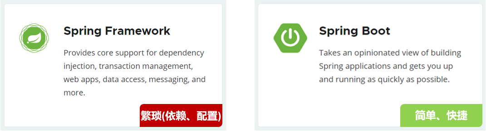

> 基于 Spring 存在的问题，官方在 Spring 框架 4.0 版本之后，又推出了一个全新的框架：SpringBoot。
>
> 通过 SpringBoot 来简化 Spring 框架的开发(是简化不是替代)

SpringBoot 框架之所以使用起来更简单更快捷，是因为 SpringBoot 框架底层提供了两个非常重要的功能：一个是起步依赖，一个是自动配置。


> 通过 SpringBoot 所提供的起步依赖，就可以大大的简化 pom 文件当中依赖的配置，从而解决了 Spring 框架当中依赖配置繁琐的问题。
>
> 通过自动配置的功能就可以大大的简化框架在使用时 bean 的声明以及 bean 的配置。只需要引入程序开发时所需要的起步依赖，项目开发时所用到常见的配置都已经有了，直接使用就可以了。

### 3.1 起步依赖

假如用的是 Spring 框架进行 web 程序的开发，引入 web 程序开发所需要的一些依赖。

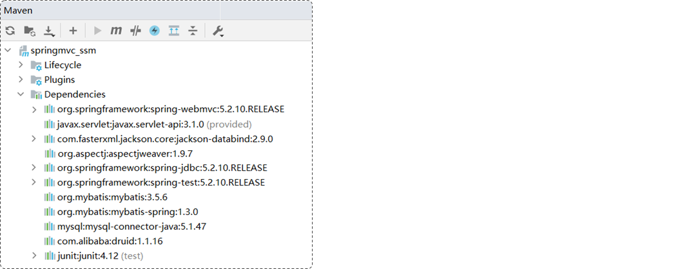

> spring-webmvc 依赖：这是 Spring 框架进行 web 程序开发所需要的依赖
>
> servlet-api 依赖：Servlet 基础依赖
>
> jackson-databind 依赖：JSON 处理工具包
>
> 如果要使用 AOP，还需要引入 aop 依赖、aspect 依赖
>
> 项目中所引入的这些依赖，还需要保证版本匹配，否则就可能会出现版本冲突问题。

SpringBoo 只需要引入一个依赖就可以了，springboot-starter-web。

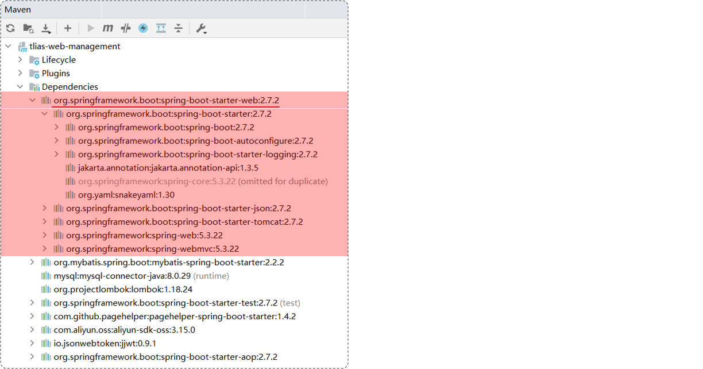

为什么引入一个 web 开发的起步依赖，web 开发所需要的所有的依赖都有了呢？

因为 Maven 的依赖传递。

> - 在 SpringBoot 提供的这些起步依赖当中，已提供了当前程序开发所需要的所有的常见依赖(官网地址：[https://docs.spring.io/spring-boot/docs/2.7.7/reference/htmlsingle/#using.build-systems.starters])
>
> - 比如：springboot-starter-web，这是 web 开发的起步依赖，在 web 开发的起步依赖当中，就集成了 web 开发中常见的依赖：json、web、webmvc、tomcat 等。只需要引入这一个起步依赖，其他的依赖都会自动的通过 Maven 的依赖传递进来。

**结论：起步依赖的原理就是 Maven 的依赖传递。**

### 3.2 自动配置

#### 3.2.1 概述

SpringBoot 的自动配置就是当 Spring 容器启动后，一些配置类、bean 对象就自动存入到了 IOC 容器中，不需要手动去声明，从而简化了开发，省去了繁琐的配置操作。

> 比如：要进行事务管理、要进行 AOP 程序的开发，此时就不需要再去手动的声明这些 bean 对象了

- 运行 SpringBoot 启动类

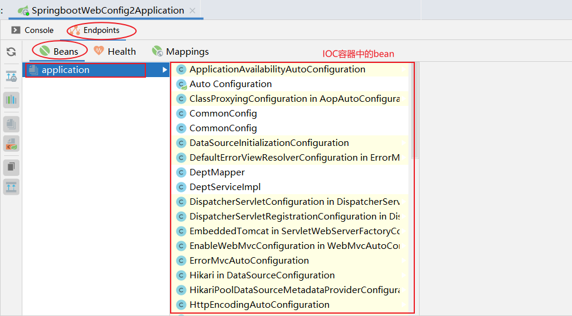

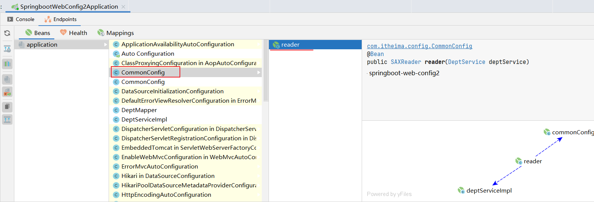

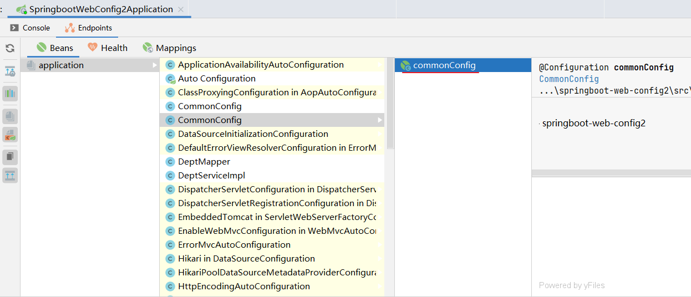

有两个 CommonConfig，在第一个 CommonConfig 类中定义了一个 bean 对象，bean 对象的名字叫 reader。

在第二个 CommonConfig 中它的 bean 名字叫 commonConfig，为什么还会有这样一个 bean 对象呢？原因是在 CommonConfig 配置类上添加了一个注解@Configuration，而@Configuration 底层就是@Component

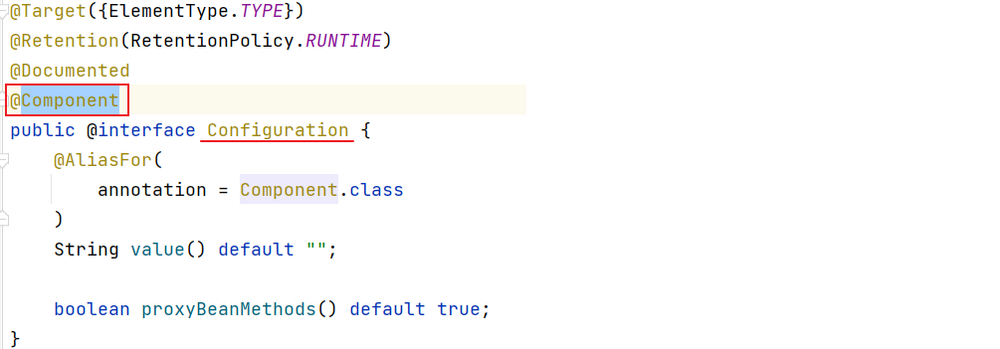

> 所以配置类最终也是 SpringIOC 容器当中的一个 bean 对象

在 IOC 容器中除了自己定义的 bean 以外，还有很多 SpringBoot 在启动的时候加载进来的配置类。这些配置类加载进来之后，也会生成很多的 bean 对象。

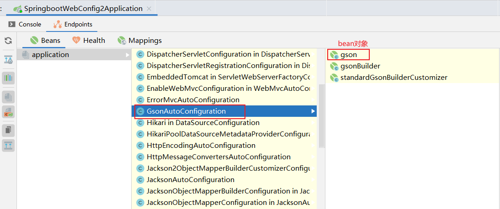

> 比如：配置类 GsonAutoConfiguration 里面有一个 bean，bean 的名字叫 gson，它的类型是 Gson。
>
> com.google.gson.Gson 是谷歌包中提供的用来处理 JSON 格式数据的。

使用这些配置类中生成的 bean 对象时，使用@Autowired 就自动注入了：

```java
import com.google.gson.Gson;
import com.itheima.pojo.Result;
import org.junit.jupiter.api.Test;
import org.springframework.beans.factory.annotation.Autowired;
import org.springframework.boot.test.context.SpringBootTest;

@SpringBootTest
public class AutoConfigurationTests {

    @Autowired
    private Gson gson;


    @Test
    public void testJson(){
        String json = gson.toJson(Result.success());
        System.out.println(json);
    }
}
```

添加断点，使用 debug 模式运行测试类程序：

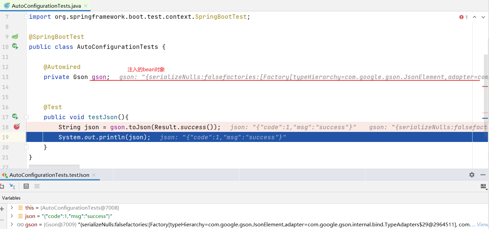

问题：项目中并没有声明谷歌提供的 Gson 这么一个 bean 对象，却可以通过@Autowired 从 Spring 容器中注入 bean 对象，那么这个 bean 对象怎么来的？

答案：SpringBoot 项目在启动时通过自动配置完成了 bean 对象的创建。

#### 3.2.2 常见方案

引入对应的依赖之后，是如何将依赖 jar 包当中所提供的 bean 以及配置类直接加载到当前项目的 SpringIOC 容器当中的。

> 准备工作：在 Idea 中导入"资料\03. 自动配置原理"下的 itheima-utils 工程

1、在 SpringBoot 项目 spring-boot-web-config2 工程中，通过坐标引入 itheima-utils 依赖

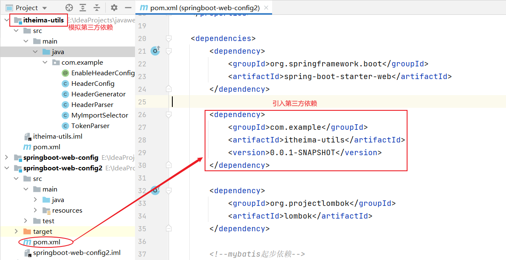

```java
@Component
public class TokenParser {
    public void parse(){
        System.out.println("TokenParser ... parse ...");
    }
}
```

2、在测试类中，添加测试方法

```java
@SpringBootTest
public class AutoConfigurationTests {

    @Autowired
    private ApplicationContext applicationContext;


    @Test
    public void testTokenParse(){
        System.out.println(applicationContext.getBean(TokenParser.class));
    }

    //省略其他代码...
}
```

3、执行测试方法

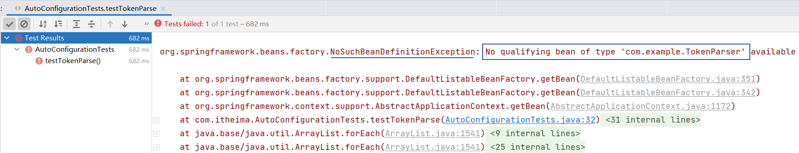

> 异常信息描述： 没有 com.example.TokenParse 类型的 bean
>
> 说明：在 Spring 容器中没有找到 com.example.TokenParse 类型的 bean 对象

思考：引入进来的第三方依赖当中的 bean 以及配置类为什么没有生效？

- 在类上添加@Component 注解来声明 bean 对象时，还需要保证@Component 注解能被 Spring 的组件扫描到。
- SpringBoot 项目中的@SpringBootApplication 注解，具有包扫描的作用，但是它只会扫描启动类所在的当前包以及子包。
- 当前包：com.itheima， 第三方依赖中提供的包：com.example（扫描不到）

那么如何解决以上问题的呢？

- 方案 1：@ComponentScan 组件扫描
- 方案 2：@Import 导入（使用@Import 导入的类会被 Spring 加载到 IOC 容器中）

##### 3.2.2.2 方案一

@ComponentScan 组件扫描

```java
@SpringBootApplication
@ComponentScan({"com.itheima","com.example"}) //指定要扫描的包
public class SpringbootWebConfig2Application {
    public static void main(String[] args) {
        SpringApplication.run(SpringbootWebConfig2Application.class, args);
    }
}

```

重新执行测试方法，控制台日志输出：

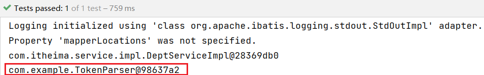

> 缺点：
>
> 1. 使用繁琐
> 2. 性能低

**方案二**：

@Import 导入

- 导入形式主要有以下几种：

  1. 导入普通类
  2. 导入配置类
  3. 导入 ImportSelector 接口实现类

  1). 使用@Import 导入普通类：

```java
@Import(TokenParser.class) //导入的类会被Spring加载到IOC容器中
@SpringBootApplication
public class SpringbootWebConfig2Application {
    public static void main(String[] args) {
        SpringApplication.run(SpringbootWebConfig2Application.class, args);
    }
}
```

> 重新执行测试方法，控制台日志输出：
>
> 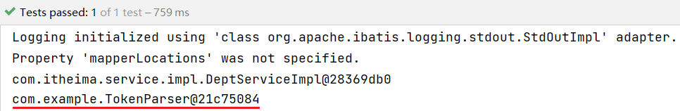

2). 使用@Import 导入配置类：

- 配置类

```java
@Configuration
public class HeaderConfig {
    @Bean
    public HeaderParser headerParser(){
        return new HeaderParser();
    }

    @Bean
    public HeaderGenerator headerGenerator(){
        return new HeaderGenerator();
    }
}
```

- 启动类

```java
@Import(HeaderConfig.class) //导入配置类
@SpringBootApplication
public class SpringbootWebConfig2Application {
    public static void main(String[] args) {
        SpringApplication.run(SpringbootWebConfig2Application.class, args);
    }
}
```

- 测试类

```java
@SpringBootTest
public class AutoConfigurationTests {
    @Autowired
    private ApplicationContext applicationContext;

    @Test
    public void testHeaderParser(){
        System.out.println(applicationContext.getBean(HeaderParser.class));
    }

    @Test
    public void testHeaderGenerator(){
        System.out.println(applicationContext.getBean(HeaderGenerator.class));
    }

    //省略其他代码...
}
```

> 执行测试方法：
>
> 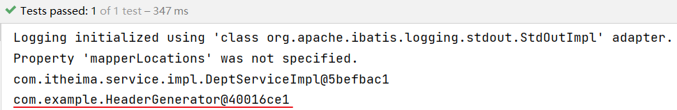

3). 使用@Import 导入 ImportSelector 接口实现类：

- ImportSelector 接口实现类

```java
public class MyImportSelector implements ImportSelector {
    public String[] selectImports(AnnotationMetadata importingClassMetadata) {
        //返回值字符串数组（数组中封装了全限定名称的类）
        return new String[]{"com.example.HeaderConfig"};
    }
}
```

- 启动类

```java
@Import(MyImportSelector.class) //导入ImportSelector接口实现类
@SpringBootApplication
public class SpringbootWebConfig2Application {

    public static void main(String[] args) {
        SpringApplication.run(SpringbootWebConfig2Application.class, args);
    }
}

```

> 执行测试方法：
>
> 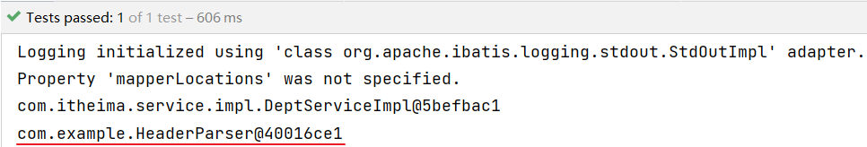

使用@Import 注解通过这三种方式都可以导入第三方依赖中所提供的 bean 或者是配置类。

思考：如果基于以上方式完成自动配置，当要引入一个第三方依赖时，是不是还要知道第三方依赖中有哪些配置类和哪些 Bean 对象？

- 答案：是的。 （对程序员来讲，很不友好，而且比较繁琐）

思考：当我们要使用第三方依赖，依赖中到底有哪些 bean 和配置类，谁最清楚？

- 答案：第三方依赖自身最清楚。

> **结论：我们不用自己指定要导入哪些 bean 对象和配置类了，让第三方依赖它自己来指定。**

怎么让第三方依赖自己指定 bean 对象和配置类？

- 比较常见的方案就是第三方依赖给我们提供一个注解，这个注解一般都以@EnableXxxx 开头的注解，注解中封装的就是@Import 注解

  4). 使用第三方依赖提供的 @EnableXxxxx 注解

- 第三方依赖中提供的注解

```java
@Retention(RetentionPolicy.RUNTIME)
@Target(ElementType.TYPE)
@Import(MyImportSelector.class)//指定要导入哪些bean对象或配置类
public @interface EnableHeaderConfig {
}
```

- 在使用时只需在启动类上加上@EnableXxxxx 注解即可

```java
@EnableHeaderConfig  //使用第三方依赖提供的Enable开头的注解
@SpringBootApplication
public class SpringbootWebConfig2Application {
    public static void main(String[] args) {
        SpringApplication.run(SpringbootWebConfig2Application.class, args);
    }
}

```

> 执行测试方法：
>
> 

以上四种方式都可以完成导入操作，但是第 4 种方式会更方便更优雅，而这种方式也是 SpringBoot 当中所采用的方式。

#### 3.2.3 原理分析

##### 3.2.3.1 源码跟踪

前面我们讲解了在项目当中引入第三方依赖之后，如何加载第三方依赖中定义好的 bean 对象以及配置类，从而完成自动配置操作。那下面我们通过源码跟踪的形式来剖析下 SpringBoot 底层到底是如何完成自动配置的。

> 源码跟踪技巧：
>
> 在跟踪框架源码的时候，一定要抓住关键点，找到核心流程。一定不要从头到尾一行代码去看，一个方法的去研究，一定要找到关键流程，抓住关键点，先在宏观上对整个流程或者整个原理有一个认识，有精力再去研究其中的细节。

要搞清楚 SpringBoot 的自动配置原理，要从 SpringBoot 启动类上使用的核心注解@SpringBootApplication 开始分析：

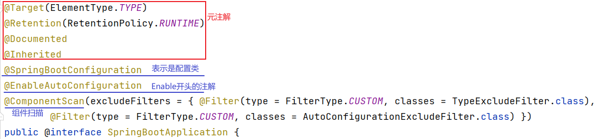

在@SpringBootApplication 注解中包含了：

- 元注解（不再解释）
- @SpringBootConfiguration
- @EnableAutoConfiguration
- @ComponentScan

我们先来看第一个注解：@SpringBootConfiguration

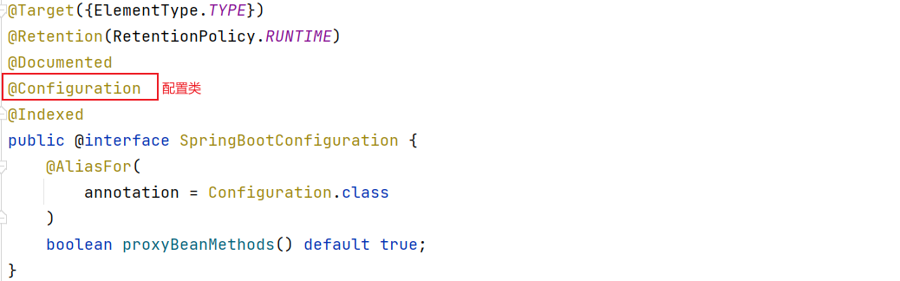

> @SpringBootConfiguration 注解上使用了@Configuration，表明 SpringBoot 启动类就是一个配置类。
>
> @Indexed 注解，是用来加速应用启动的（不用关心）。

接下来再先看@ComponentScan 注解：

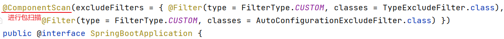

> @ComponentScan 注解是用来进行组件扫描的，扫描启动类所在的包及其子包下所有被@Component 及其衍生注解声明的类。
>
> SpringBoot 启动类，之所以具备扫描包功能，就是因为包含了@ComponentScan 注解。

最后我们来看看@EnableAutoConfiguration 注解（自动配置核心注解）：

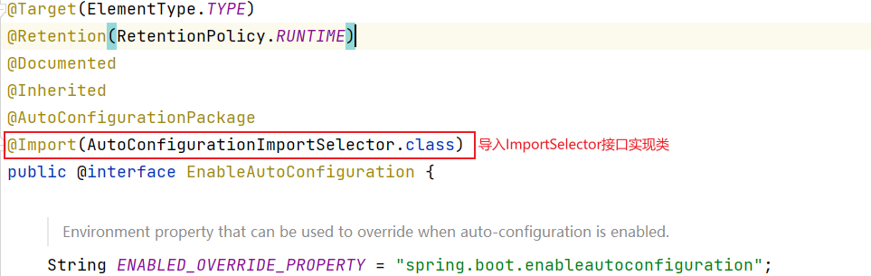

> 使用@Import 注解，导入了实现 ImportSelector 接口的实现类。
>
> AutoConfigurationImportSelector 类是 ImportSelector 接口的实现类。
>
> 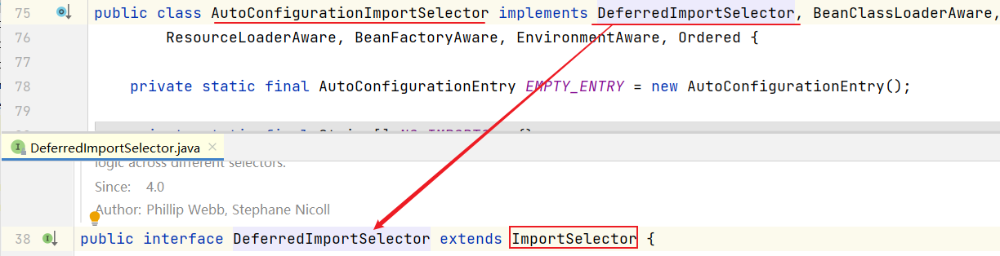

AutoConfigurationImportSelector 类中重写了 ImportSelector 接口的 selectImports()方法：

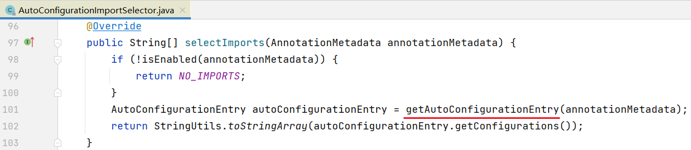

> selectImports()方法底层调用 getAutoConfigurationEntry()方法，获取可自动配置的配置类信息集合

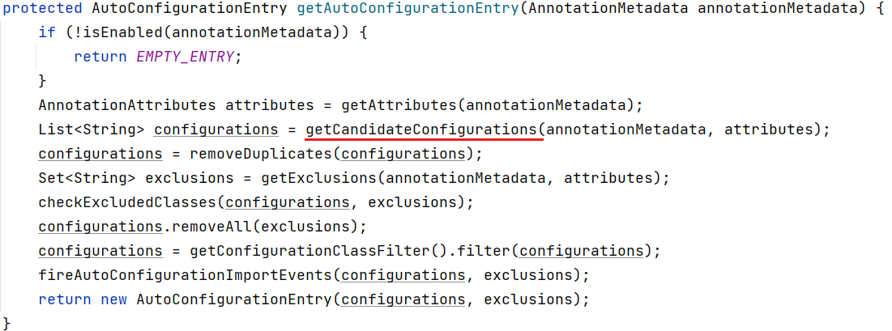

> getAutoConfigurationEntry()方法通过调用 getCandidateConfigurations(annotationMetadata, attributes)方法获取在配置文件中配置的所有自动配置类的集合

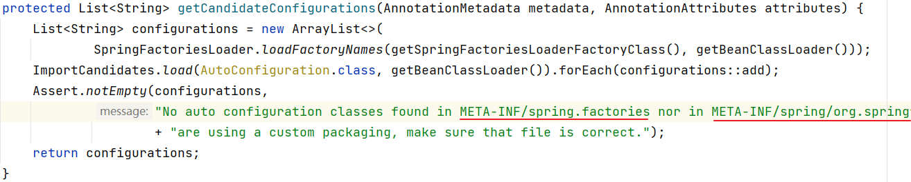

> getCandidateConfigurations 方法的功能：
>
> 获取所有基于 META-INF/spring/org.springframework.boot.autoconfigure.AutoConfiguration.imports 文件、META-INF/spring.factories 文件中配置类的集合

META-INF/spring/org.springframework.boot.autoconfigure.AutoConfiguration.imports 文件和 META-INF/spring.factories 文件这两个文件在哪里呢？

- 通常在引入的起步依赖中，都有包含以上两个文件

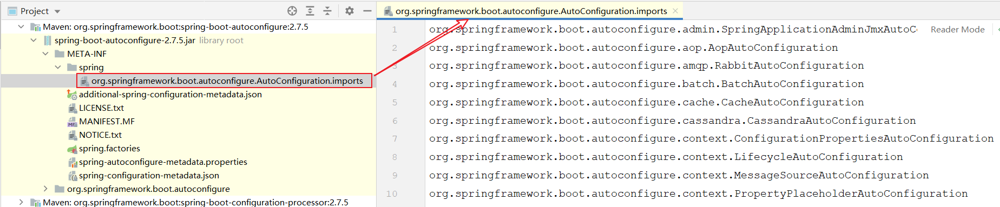

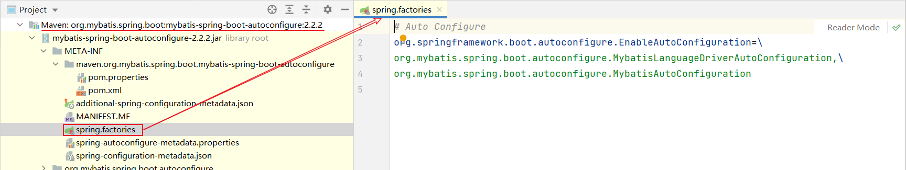

在前面在给大家演示自动配置的时候，我们直接在测试类当中注入了一个叫 gson 的 bean 对象，进行 JSON 格式转换。虽然我们没有配置 bean 对象，但是我们是可以直接注入使用的。原因就是因为在自动配置类当中做了自动配置。到底是在哪个自动配置类当中做的自动配置呢？我们通过搜索来查询一下。

在 META-INF/spring/org.springframework.boot.autoconfigure.AutoConfiguration.imports 配置文件中指定了第三方依赖 Gson 的配置类：GsonAutoConfiguration

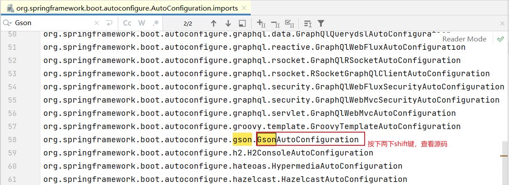

第三方依赖中提供的 GsonAutoConfiguration 类：

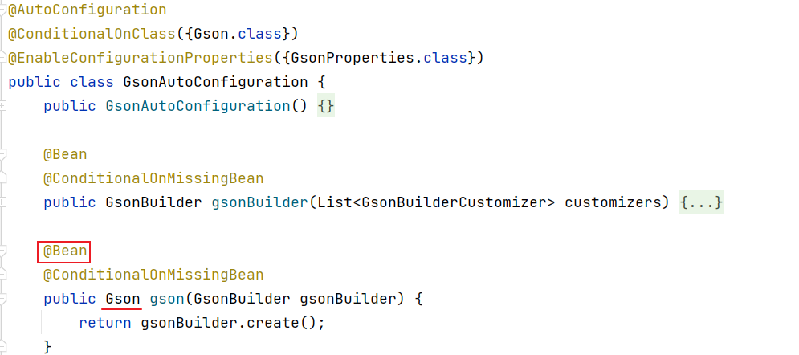

> 在 GsonAutoConfiguration 类上，添加了注解@AutoConfiguration，通过查看源码，可以明确：GsonAutoConfiguration 类是一个配置。
>
> 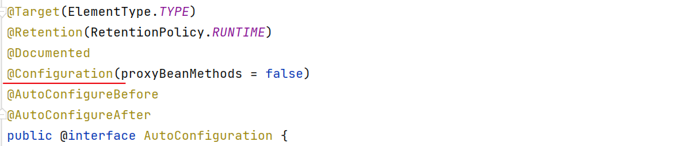

看到这里，大家就应该明白为什么可以完成自动配置了，原理就是在配置类中定义一个@Bean 标识的方法，而 Spring 会自动调用配置类中使用@Bean 标识的方法，并把方法的返回值注册到 IOC 容器中。

**自动配置源码小结**:

自动配置原理源码入口就是@SpringBootApplication 注解，在这个注解中封装了 3 个注解，分别是：

- @SpringBootConfiguration
  - 声明当前类是一个配置类
- @ComponentScan
  - 进行组件扫描（SpringBoot 中默认扫描的是启动类所在的当前包及其子包）
- @EnableAutoConfiguration
  - 封装了@Import 注解（Import 注解中指定了一个 ImportSelector 接口的实现类）
    - 在实现类重写的 selectImports()方法，读取当前项目下所有依赖 jar 包中 META-INF/spring.factories、META-INF/spring/org.springframework.boot.autoconfigure.AutoConfiguration.imports 两个文件里面定义的配置类（配置类中定义了@Bean 注解标识的方法）。

当 SpringBoot 程序启动时，就会加载配置文件当中所定义的配置类，并将这些配置类信息(类的全限定名)封装到 String 类型的数组中，最终通过@Import 注解将这些配置类全部加载到 Spring 的 IOC 容器中，交给 IOC 容器管理。

> 最后呢给大家抛出一个问题：在 META-INF/spring/org.springframework.boot.autoconfigure.AutoConfiguration.imports 文件中定义的配置类非常多，而且每个配置类中又可以定义很多的 bean，那这些 bean 都会注册到 Spring 的 IOC 容器中吗？
>
> 答案：并不是。 在声明 bean 对象时，上面有加一个以@Conditional 开头的注解，这种注解的作用就是按照条件进行装配，只有满足条件之后，才会将 bean 注册到 Spring 的 IOC 容器中（下面会详细来讲解）

##### 3.2.3.2 @Conditional

我们在跟踪 SpringBoot 自动配置的源码的时候，在自动配置类声明 bean 的时候，除了在方法上加了一个@Bean 注解以外，还会经常用到一个注解，就是以 Conditional 开头的这一类的注解。以 Conditional 开头的这些注解都是条件装配的注解。下面我们就来介绍下条件装配注解。

@Conditional 注解：

- 作用：按照一定的条件进行判断，在满足给定条件后才会注册对应的 bean 对象到 Spring 的 IOC 容器中。
- 位置：方法、类
- @Conditional 本身是一个父注解，派生出大量的子注解：
  - @ConditionalOnClass：判断环境中有对应字节码文件，才注册 bean 到 IOC 容器。
  - @ConditionalOnMissingBean：判断环境中没有对应的 bean(类型或名称)，才注册 bean 到 IOC 容器。
  - @ConditionalOnProperty：判断配置文件中有对应属性和值，才注册 bean 到 IOC 容器。

下面我们通过代码来演示下 Conditional 注解的使用：

- @ConditionalOnClass 注解

```java
@Configuration
public class HeaderConfig {

    @Bean
    @ConditionalOnClass(name="io.jsonwebtoken.Jwts")//环境中存在指定的这个类，才会将该bean加入IOC容器
    public HeaderParser headerParser(){
        return new HeaderParser();
    }

    //省略其他代码...
}
```

- pom.xml

```java
<!--JWT令牌-->
<dependency>
     <groupId>io.jsonwebtoken</groupId>
     <artifactId>jjwt</artifactId>
     <version>0.9.1</version>
</dependency>
```

- 测试类

```java
@SpringBootTest
public class AutoConfigurationTests {
    @Autowired
    private ApplicationContext applicationContext;

    @Test
    public void testHeaderParser(){
        System.out.println(applicationContext.getBean(HeaderParser.class));
    }

    //省略其他代码...
}
```

> 执行 testHeaderParser()测试方法：
>
> 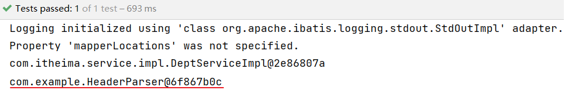
>
> 因为 io.jsonwebtoken.Jwts 字节码文件在启动 SpringBoot 程序时已存在，所以创建 HeaderParser 对象并注册到 IOC 容器中。

- @ConditionalOnMissingBean 注解

```java
@Configuration
public class HeaderConfig {

    @Bean
    @ConditionalOnMissingBean //不存在该类型的bean，才会将该bean加入IOC容器
    public HeaderParser headerParser(){
        return new HeaderParser();
    }

    //省略其他代码...
}
```

> 执行 testHeaderParser()测试方法：
>
> 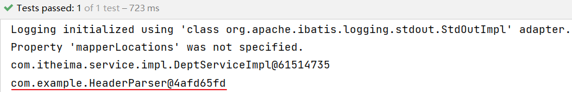
>
> SpringBoot 在调用@Bean 标识的 headerParser()前，IOC 容器中是没有 HeaderParser 类型的 bean，所以 HeaderParser 对象正常创建，并注册到 IOC 容器中。

再次修改@ConditionalOnMissingBean 注解：

```java
@Configuration
public class HeaderConfig {

    @Bean
    @ConditionalOnMissingBean(name="deptController2")//不存在指定名称的bean，才会将该bean加入IOC容器
    public HeaderParser headerParser(){
        return new HeaderParser();
    }

    //省略其他代码...
}
```

> 执行 testHeaderParser()测试方法：
>
> 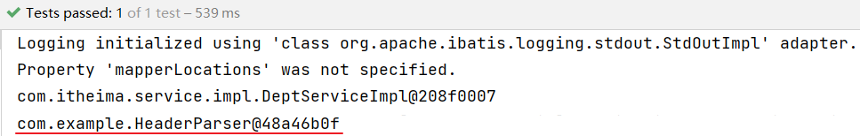
>
> 因为在 SpringBoot 环境中不存在名字叫 deptController2 的 bean 对象，所以创建 HeaderParser 对象并注册到 IOC 容器中。

再次修改@ConditionalOnMissingBean 注解：

```java
@Configuration
public class HeaderConfig {

    @Bean
    @ConditionalOnMissingBean(HeaderConfig.class)//不存在指定类型的bean，才会将bean加入IOC容器
    public HeaderParser headerParser(){
        return new HeaderParser();
    }

    //省略其他代码...
}
```

```java
@SpringBootTest
public class AutoConfigurationTests {
    @Autowired
    private ApplicationContext applicationContext;

    @Test
    public void testHeaderParser(){
        System.out.println(applicationContext.getBean(HeaderParser.class));
    }

    //省略其他代码...
}
```

> 执行 testHeaderParser()测试方法：
>
> 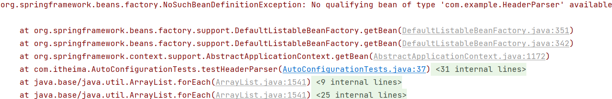
>
> 因为 HeaderConfig 类中添加@Configuration 注解，而@Configuration 注解中包含了@Component，所以 SpringBoot 启动时会创建 HeaderConfig 类对象，并注册到 IOC 容器中。
>
> 当 IOC 容器中有 HeaderConfig 类型的 bean 存在时，不会把创建 HeaderParser 对象注册到 IOC 容器中。而 IOC 容器中没有 HeaderParser 类型的对象时，通过 getBean(HeaderParser.class)方法获取 bean 对象时，引发异常：NoSuchBeanDefinitionException

- @ConditionalOnProperty 注解（这个注解和配置文件当中配置的属性有关系）

先在 application.yml 配置文件中添加如下的键值对：

```yaml
name: itheima
```

在声明 bean 的时候就可以指定一个条件@ConditionalOnProperty

```java
@Configuration
public class HeaderConfig {

    @Bean
    @ConditionalOnProperty(name ="name",havingValue = "itheima")//配置文件中存在指定属性名与值，才会将bean加入IOC容器
    public HeaderParser headerParser(){
        return new HeaderParser();
    }

    @Bean
    public HeaderGenerator headerGenerator(){
        return new HeaderGenerator();
    }
}
```

> 执行 testHeaderParser()测试方法：
>
> 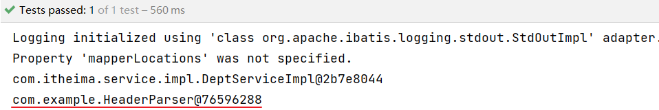

修改@ConditionalOnProperty 注解： havingValue 的值修改为"itheima2"

```java
@Bean
@ConditionalOnProperty(name ="name",havingValue = "itheima2")//配置文件中存在指定属性名与值，才会将bean加入IOC容器
public HeaderParser headerParser(){
        return new HeaderParser();
}
```

> 再次执行 testHeaderParser()测试方法：
>
> 
>
> 因为 application.yml 配置文件中，不存在： name: itheima2，所以 HeaderParser 对象在 IOC 容器中不存在

我们再回头看看之前讲解 SpringBoot 源码时提到的一个配置类：GsonAutoConfiguration

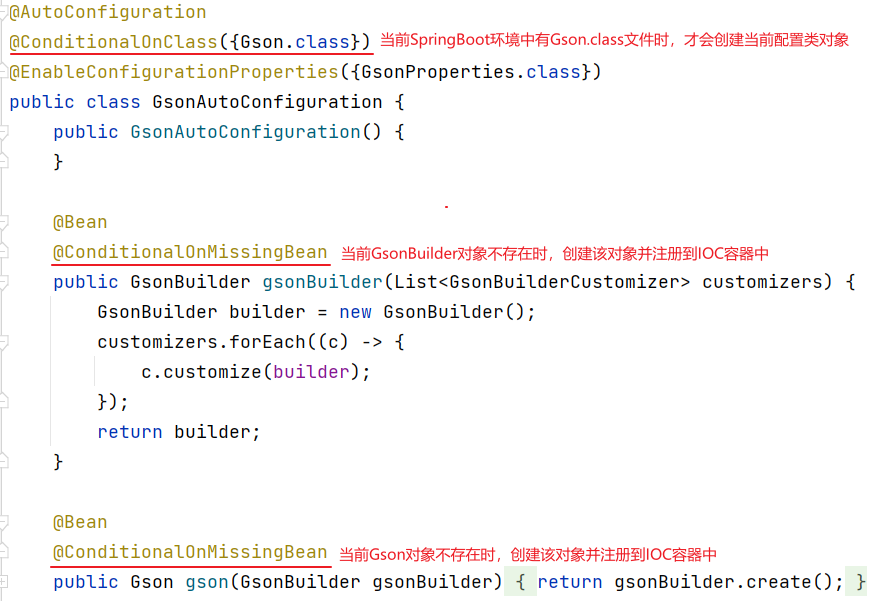

最后再给大家梳理一下自动配置原理：

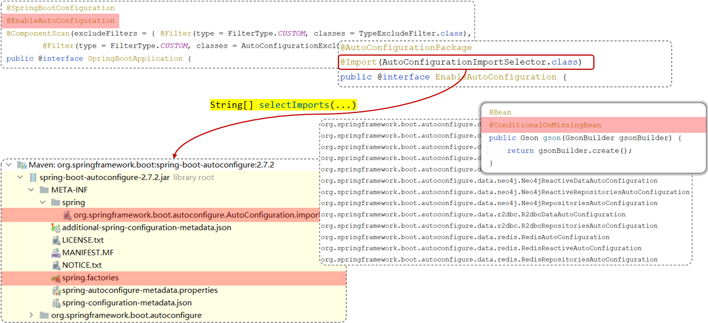

> 自动配置的核心就在@SpringBootApplication 注解上，SpringBootApplication 这个注解底层包含了 3 个注解，分别是：
>
> - @SpringBootConfiguration
>
> - @ComponentScan
>
> - @EnableAutoConfiguration
>
> @EnableAutoConfiguration 这个注解才是自动配置的核心。
>
> - 它封装了一个@Import 注解，Import 注解里面指定了一个 ImportSelector 接口的实现类。
> - 在这个实现类中，重写了 ImportSelector 接口中的 selectImports()方法。
> - 而 selectImports()方法中会去读取两份配置文件，并将配置文件中定义的配置类做为 selectImports()方法的返回值返回，返回值代表的就是需要将哪些类交给 Spring 的 IOC 容器进行管理。
> - 那么所有自动配置类的中声明的 bean 都会加载到 Spring 的 IOC 容器中吗? 其实并不会，因为这些配置类中在声明 bean 时，通常都会添加@Conditional 开头的注解，这个注解就是进行条件装配。而 Spring 会根据 Conditional 注解有选择性的进行 bean 的创建。
> - @Enable 开头的注解底层，它就封装了一个注解 import 注解，它里面指定了一个类，是 ImportSelector 接口的实现类。在实现类当中，我们需要去实现 ImportSelector 接口当中的一个方法 selectImports 这个方法。这个方法的返回值代表的就是我需要将哪些类交给 spring 的 IOC 容器进行管理。
> - 此时它会去读取两份配置文件，一份儿是 spring.factories，另外一份儿是 autoConfiguration.imports。而在 autoConfiguration.imports 这份儿文件当中，它就会去配置大量的自动配置的类。
> - 而前面我们也提到过这些所有的自动配置类当中，所有的 bean 都会加载到 spring 的 IOC 容器当中吗？其实并不会，因为这些配置类当中，在声明 bean 的时候，通常会加上这么一类@Conditional 开头的注解。这个注解就是进行条件装配。所以 SpringBoot 非常的智能，它会根据 @Conditional 注解来进行条件装配。只有条件成立，它才会声明这个 bean，才会将这个 bean 交给 IOC 容器管理。

#### 3.2.4 案例

##### 3.2.4.1 自定义 starter 分析

前面我们解析了 SpringBoot 中自动配置的原理，下面我们就通过一个自定义 starter 案例来加深大家对于自动配置原理的理解。首先介绍一下自定义 starter 的业务场景，再来分析一下具体的操作步骤。

所谓 starter 指的就是 SpringBoot 当中的起步依赖。在 SpringBoot 当中已经给我们提供了很多的起步依赖了，我们为什么还需要自定义 starter 起步依赖？这是因为在实际的项目开发当中，我们可能会用到很多第三方的技术，并不是所有的第三方的技术官方都给我们提供了与 SpringBoot 整合的 starter 起步依赖，但是这些技术又非常的通用，在很多项目组当中都在使用。

业务场景：

- 我们前面案例当中所使用的阿里云 OSS 对象存储服务，现在阿里云的官方是没有给我们提供对应的起步依赖的，这个时候使用起来就会比较繁琐，我们需要引入对应的依赖。我们还需要在配置文件当中进行配置，还需要基于官方 SDK 示例来改造对应的工具类，我们在项目当中才可以进行使用。
- 大家想在我们当前项目当中使用了阿里云 OSS，我们需要进行这么多步的操作。在别的项目组当中要想使用阿里云 OSS，是不是也需要进行这么多步的操作，所以这个时候我们就可以自定义一些公共组件，在这些公共组件当中，我就可以提前把需要配置的 bean 都提前配置好。将来在项目当中，我要想使用这个技术，我直接将组件对应的坐标直接引入进来，就已经自动配置好了，就可以直接使用了。我们也可以把公共组件提供给别的项目组进行使用，这样就可以大大的简化我们的开发。

在 SpringBoot 项目中，一般都会将这些公共组件封装为 SpringBoot 当中的 starter，也就是我们所说的起步依赖。


> SpringBoot 官方 starter 命名： spring-boot-starter-xxxx
>
> 第三组织提供的 starter 命名： xxxx-spring-boot-starter

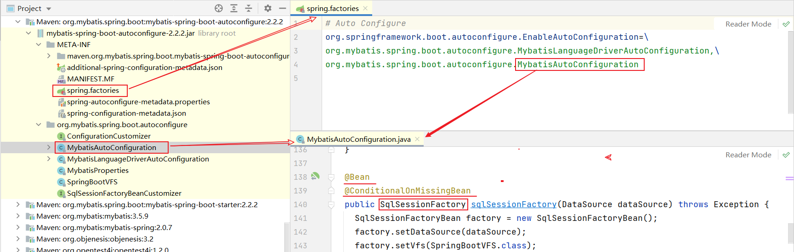

> Mybatis 提供了配置类，并且也提供了 springboot 会自动读取的配置文件。当 SpringBoot 项目启动时，会读取到 spring.factories 配置文件中的配置类并加载配置类，生成相关 bean 对象注册到 IOC 容器中。
>
> 结果：我们可以直接在 SpringBoot 程序中使用 Mybatis 自动配置的 bean 对象。

在自定义一个起步依赖 starter 的时候，按照规范需要定义两个模块：

1. starter 模块（进行依赖管理[把程序开发所需要的依赖都定义在 starter 起步依赖中]）
2. autoconfigure 模块（自动配置）

> 将来在项目当中进行相关功能开发时，只需要引入一个起步依赖就可以了，因为它会将 autoconfigure 自动配置的依赖给传递下来。

上面我们简单介绍了自定义 starter 的场景，以及自定义 starter 时涉及到的模块之后，接下来我们就来完成一个自定义 starter 的案例。

需求：自定义 aliyun-oss-spring-boot-starter，完成阿里云 OSS 操作工具类 AliyunOSSUtils 的自动配置。

目标：引入起步依赖引入之后，要想使用阿里云 OSS，注入 AliyunOSSUtils 直接使用即可。

之前阿里云 OSS 的使用：

- 配置文件

```yaml
#配置阿里云OSS参数
aliyun:
  oss:
    endpoint: https://oss-cn-shanghai.aliyuncs.com
    bucketName: web-framework01
```

- AliOSSProperties 类

```java
@Data
@Component
@ConfigurationProperties(prefix = "aliyun.oss")
public class AliOSSProperties {
    //区域
    private String endpoint;
    //存储空间
    private String bucketName;
}

```

- AliOSSUtils 工具类

```java
@Component //当前类对象由Spring创建和管理
public class AliOSSUtils {
    @Autowired
    private AliOSSProperties aliOSSProperties;

    /**
     * 实现上传图片到OSS
     */
    public String upload(MultipartFile multipartFile) throws IOException {
        // 获取上传的文件的输入流
        InputStream inputStream = multipartFile.getInputStream();

        // 避免文件覆盖
        String originalFilename = multipartFile.getOriginalFilename();
        String fileName = UUID.randomUUID().toString() + originalFilename.substring(originalFilename.lastIndexOf("."));

        //上传文件到 OSS
        OSS ossClient = new OSSClientBuilder().build(aliOSSProperties.getEndpoint(),
                aliOSSProperties.getAccessKeyId(), aliOSSProperties.getAccessKeySecret());
        ossClient.putObject(aliOSSProperties.getBucketName(), fileName, inputStream);

        //文件访问路径
        String url =aliOSSProperties.getEndpoint().split("//")[0] + "//" + aliOSSProperties.getBucketName() + "." + aliOSSProperties.getEndpoint().split("//")[1] + "/" + fileName;

        // 关闭ossClient
        ossClient.shutdown();
        return url;// 把上传到oss的路径返回
    }
}
```

当我们在项目当中要使用阿里云 OSS，就可以注入 AliOSSUtils 工具类来进行文件上传。但这种方式其实是比较繁琐的。

大家再思考，现在我们使用阿里云 OSS，需要做这么几步，将来大家在开发其他的项目的时候，你使用阿里云 OSS，这几步你要不要做？当团队中其他小伙伴也在使用阿里云 OSS 的时候，步骤 不也是一样的。

所以这个时候我们就可以制作一个公共组件(自定义 starter)。starter 定义好之后，将来要使用阿里云 OSS 进行文件上传，只需要将起步依赖引入进来之后，就可以直接注入 AliOSSUtils 使用了。

需求明确了，接下来我们再来分析一下具体的实现步骤：

- 第 1 步：创建自定义 starter 模块（进行依赖管理）
  - 把阿里云 OSS 所有的依赖统一管理起来
- 第 2 步：创建 autoconfigure 模块
  - 在 starter 中引入 autoconfigure （我们使用时只需要引入 starter 起步依赖即可）
- 第 3 步：在 autoconfigure 中完成自动配置
  1. 定义一个自动配置类，在自动配置类中将所要配置的 bean 都提前配置好
  2. 定义配置文件，把自动配置类的全类名定义在配置文件中

我们分析完自定义阿里云 OSS 自动配置的操作步骤了，下面我们就按照分析的步骤来实现自定义 starter。

##### 3.2.4.2 自定义 starter 实现

自定义 starter 的步骤我们刚才已经分析了，接下来我们就按照分析的步骤来完成自定义 starter 的开发。

首先我们先来创建两个 Maven 模块：

1). aliyun-oss-spring-boot-starter 模块


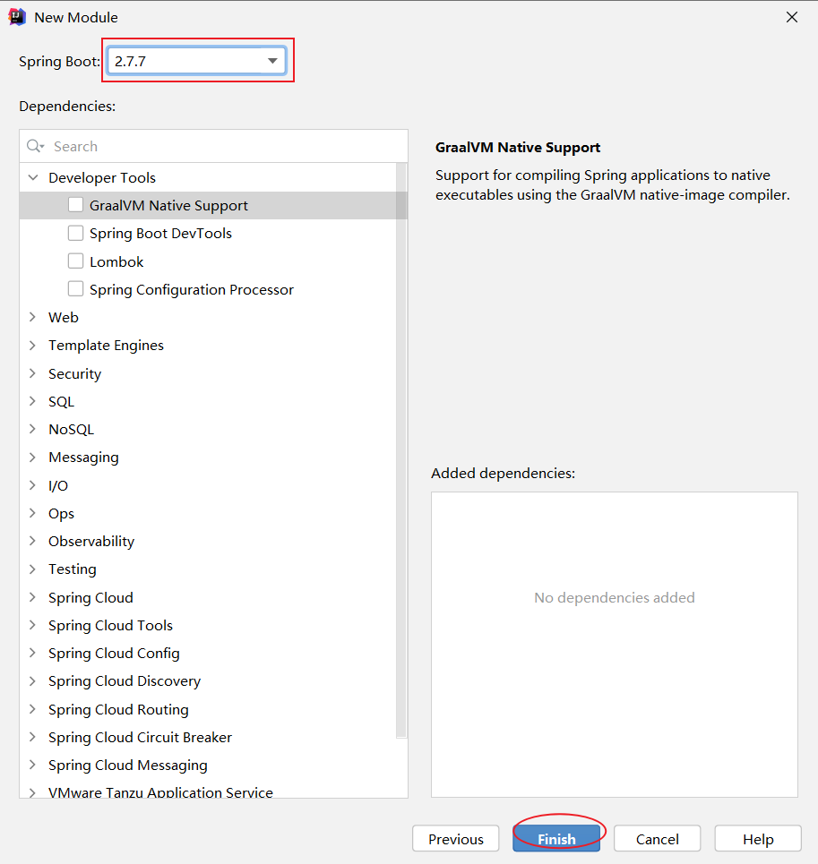

创建完 starter 模块后，删除多余的文件，最终保留内容如下：

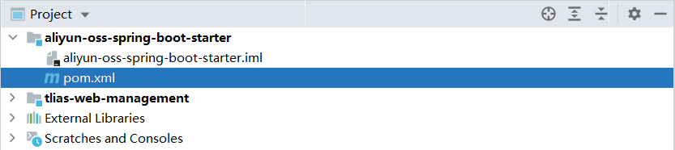

删除 pom.xml 文件中多余的内容后：

```xml
<?xml version="1.0" encoding="UTF-8"?>
<project xmlns="http://maven.apache.org/POM/4.0.0" xmlns:xsi="http://www.w3.org/2001/XMLSchema-instance"
    xsi:schemaLocation="http://maven.apache.org/POM/4.0.0 https://maven.    apache.org/xsd/maven-4.0.0.xsd">
    <modelVersion>4.0.0</modelVersion>
    <parent>
        <groupId>org.springframework.boot</groupId>
        <artifactId>spring-boot-starter-parent</artifactId>
        <version>2.7.5</version>
        <relativePath/> <!-- lookup parent from repository -->
    </parent>

    <groupId>com.aliyun.oss</groupId>
    <artifactId>aliyun-oss-spring-boot-starter</artifactId>
    <version>0.0.1-SNAPSHOT</version>

    <properties>
        <java.version>11</java.version>
    </properties>

    <dependencies>
        <dependency>
            <groupId>org.springframework.boot</groupId>
            <artifactId>spring-boot-starter</artifactId>
        </dependency>
    </dependencies>

</project>
```

2). aliyun-oss-spring-boot-autoconfigure 模块

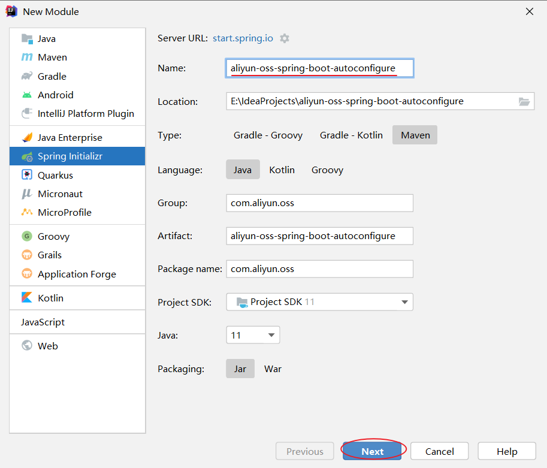


创建完 starter 模块后，删除多余的文件，最终保留内容如下：


删除 pom.xml 文件中多余的内容后：

```xml
<?xml version="1.0" encoding="UTF-8"?>
<project xmlns="http://maven.apache.org/POM/4.0.0" xmlns:xsi="http://www.w3.org/2001/XMLSchema-instance"
    xsi:schemaLocation="http://maven.apache.org/POM/4.0.0 https://maven.    apache.org/xsd/maven-4.0.0.xsd">
    <modelVersion>4.0.0</modelVersion>
    <parent>
        <groupId>org.springframework.boot</groupId>
        <artifactId>spring-boot-starter-parent</artifactId>
        <version>2.7.5</version>
        <relativePath/> <!-- lookup parent from repository -->
    </parent>

    <groupId>com.aliyun.oss</groupId>
    <artifactId>aliyun-oss-spring-boot-autoconfigure</artifactId>
    <version>0.0.1-SNAPSHOT</version>

    <properties>
        <java.version>11</java.version>
    </properties>

    <dependencies>
        <dependency>
            <groupId>org.springframework.boot</groupId>
            <artifactId>spring-boot-starter</artifactId>
        </dependency>
    </dependencies>

</project>
```

按照我们之前的分析，是需要在 starter 模块中来引入 autoconfigure 这个模块的。打开 starter 模块中的 pom 文件：

```xml
<?xml version="1.0" encoding="UTF-8"?>
<project xmlns="http://maven.apache.org/POM/4.0.0" xmlns:xsi="http://www.w3.org/2001/XMLSchema-instance"
    xsi:schemaLocation="http://maven.apache.org/POM/4.0.0 https://maven.    apache.org/xsd/maven-4.0.0.xsd">
    <modelVersion>4.0.0</modelVersion>
    <parent>
        <groupId>org.springframework.boot</groupId>
        <artifactId>spring-boot-starter-parent</artifactId>
        <version>2.7.5</version>
        <relativePath/> <!-- lookup parent from repository -->
    </parent>

    <groupId>com.aliyun.oss</groupId>
    <artifactId>aliyun-oss-spring-boot-starter</artifactId>
    <version>0.0.1-SNAPSHOT</version>

    <properties>
        <java.version>11</java.version>
    </properties>

    <dependencies>
        <!--引入autoconfigure模块-->
        <dependency>
            <groupId>com.aliyun.oss</groupId>
            <artifactId>aliyun-oss-spring-boot-autoconfigure</artifactId>
            <version>0.0.1-SNAPSHOT</version>
        </dependency>

        <dependency>
            <groupId>org.springframework.boot</groupId>
            <artifactId>spring-boot-starter</artifactId>
        </dependency>
    </dependencies>

</project>
```

前两步已经完成了，接下来是最关键的就是第三步：

在 autoconfigure 模块当中来完成自动配置操作。

> 我们将之前案例中所使用的阿里云 OSS 部分的代码直接拷贝到 autoconfigure 模块下，然后进行改造就行了。


拷贝过来后，还缺失一些相关的依赖，需要把相关依赖也拷贝过来：

```xml
<?xml version="1.0" encoding="UTF-8"?>
<project xmlns="http://maven.apache.org/POM/4.0.0" xmlns:xsi="http://www.w3.org/2001/XMLSchema-instance"
    xsi:schemaLocation="http://maven.apache.org/POM/4.0.0 https://maven.    apache.org/xsd/maven-4.0.0.xsd">
    <modelVersion>4.0.0</modelVersion>
    <parent>
        <groupId>org.springframework.boot</groupId>
        <artifactId>spring-boot-starter-parent</artifactId>
        <version>2.7.5</version>
        <relativePath/> <!-- lookup parent from repository -->
    </parent>

    <groupId>com.aliyun.oss</groupId>
    <artifactId>aliyun-oss-spring-boot-autoconfigure</artifactId>
    <version>0.0.1-SNAPSHOT</version>

    <properties>
        <java.version>11</java.version>
    </properties>

    <dependencies>
        <dependency>
            <groupId>org.springframework.boot</groupId>
            <artifactId>spring-boot-starter</artifactId>
        </dependency>

        <!--引入web起步依赖-->
        <dependency>
            <groupId>org.springframework.boot</groupId>
            <artifactId>spring-boot-starter-web</artifactId>
        </dependency>

        <!--Lombok-->
        <dependency>
            <groupId>org.projectlombok</groupId>
            <artifactId>lombok</artifactId>
        </dependency>

        <!--阿里云OSS-->
        <dependency>
            <groupId>com.aliyun.oss</groupId>
            <artifactId>aliyun-sdk-oss</artifactId>
            <version>3.15.1</version>
        </dependency>

        <dependency>
            <groupId>javax.xml.bind</groupId>
            <artifactId>jaxb-api</artifactId>
            <version>2.3.1</version>
        </dependency>
        <dependency>
            <groupId>javax.activation</groupId>
            <artifactId>activation</artifactId>
            <version>1.1.1</version>
        </dependency>
        <!-- no more than 2.3.3-->
        <dependency>
            <groupId>org.glassfish.jaxb</groupId>
            <artifactId>jaxb-runtime</artifactId>
            <version>2.3.3</version>
        </dependency>
    </dependencies>
</project>
```

现在大家思考下，在类上添加的@Component 注解还有用吗？

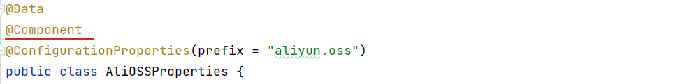

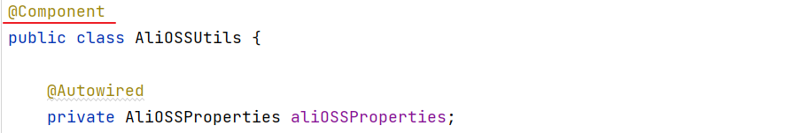

答案：没用了。 在 SpringBoot 项目中，并不会去扫描 com.aliyun.oss 这个包，不扫描这个包那类上的注解也就失去了作用。

> @Component 注解不需要使用了，可以从类上删除了。
>
> 删除后报红色错误，暂时不理会，后面再来处理。
>
> 
>
> 删除 AliOSSUtils 类中的@Component 注解、@Autowired 注解
>
> 

下面我们就要定义一个自动配置类了，在自动配置类当中来声明 AliOSSUtils 的 bean 对象。


AliOSSAutoConfiguration 类：

```java
@Configuration//当前类为Spring配置类
@EnableConfigurationProperties(AliOSSProperties.class)//导入AliOSSProperties类，并交给SpringIOC管理
public class AliOSSAutoConfiguration {


    //创建AliOSSUtils对象，并交给SpringIOC容器
    @Bean
    public AliOSSUtils aliOSSUtils(AliOSSProperties aliOSSProperties){
        AliOSSUtils aliOSSUtils = new AliOSSUtils();
        aliOSSUtils.setAliOSSProperties(aliOSSProperties);
        return aliOSSUtils;
    }
}
```

AliOSSProperties 类：

```java
/*阿里云OSS相关配置*/
@Data
@ConfigurationProperties(prefix = "aliyun.oss")
public class AliOSSProperties {
    //区域
    private String endpoint;
    //存储空间
    private String bucketName;
}
```

AliOSSUtils 类：

```java
@Data
public class AliOSSUtils {
    private AliOSSProperties aliOSSProperties;

    /**
     * 实现上传图片到OSS
     */
    public String upload(MultipartFile multipartFile) throws IOException {
        // 获取上传的文件的输入流
        InputStream inputStream = multipartFile.getInputStream();

        // 避免文件覆盖
        String originalFilename = multipartFile.getOriginalFilename();
        String fileName = UUID.randomUUID().toString() + originalFilename.substring(originalFilename.lastIndexOf("."));

        //上传文件到 OSS
        OSS ossClient = new OSSClientBuilder().build(aliOSSProperties.getEndpoint(),
                aliOSSProperties.getAccessKeyId(), aliOSSProperties.getAccessKeySecret());
        ossClient.putObject(aliOSSProperties.getBucketName(), fileName, inputStream);

        //文件访问路径
        String url =aliOSSProperties.getEndpoint().split("//")[0] + "//" + aliOSSProperties.getBucketName() + "." + aliOSSProperties.getEndpoint().split("//")[1] + "/" + fileName;

        // 关闭ossClient
        ossClient.shutdown();
        return url;// 把上传到oss的路径返回
    }
}
```

在 aliyun-oss-spring-boot-autoconfigure 模块中的 resources 下，新建自动配置文件：

- META-INF/spring/org.springframework.boot.autoconfigure.AutoConfiguration.imports

  ```java
  com.aliyun.oss.AliOSSAutoConfiguration
  ```


##### 3.2.4.3 自定义 starter 测试

阿里云 OSS 的 starter 我们刚才已经定义好了，接下来我们就来做一个测试。

> 今天的课程资料当中，提供了一个自定义 starter 的测试工程。我们直接打开文件夹，里面有一个测试工程。测试工程就是 springboot-autoconfiguration-test，我们只需要将测试工程直接导入到 Idea 当中即可。


测试前准备：

1. 在 test 工程中引入阿里云 starter 依赖

   - 通过依赖传递，会把 autoconfigure 依赖也引入了

   ```xml
   <!--引入阿里云OSS起步依赖-->
   <dependency>
       <groupId>com.aliyun.oss</groupId>
       <artifactId>aliyun-oss-spring-boot-starter</artifactId>
       <version>0.0.1-SNAPSHOT</version>
   </dependency>
   ```

2. 在 test 工程中的 application.yml 文件中，配置阿里云 OSS 配置参数信息（从以前的工程中拷贝即可）

   ```yaml
   #配置阿里云OSS参数
   aliyun:
     oss:
       endpoint: https://oss-cn-shanghai.aliyuncs.com
       bucketName: web-framework01
   ```

3. 在 test 工程中的 UploadController 类编写代码

   ```java
   @RestController
   public class UploadController {

       @Autowired
       private AliOSSUtils aliOSSUtils;

       @PostMapping("/upload")
       public String upload(MultipartFile image) throws Exception {
           //上传文件到阿里云 OSS
           String url = aliOSSUtils.upload(image);
           return url;
       }

   }
   ```

编写完代码后，我们启动当前的 SpringBoot 测试工程：

- 随着 SpringBoot 项目启动，自动配置会把 AliOSSUtils 的 bean 对象装配到 IOC 容器中


用 postman 工具进行文件上传：

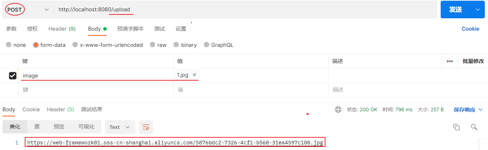

通过断点可以看到自动注入 AliOSSUtils 的 bean 对象：


## 4. Web 后端开发总结

web 后端开发现在基本上都是基于标准的三层架构进行开发的

::: tip 三层架构

Controller 控制器层 负责接收请求响应数据

Service 业务层 负责具体的业务逻辑处理

Dao 数据访问层 也叫持久层，就是用来处理数据访问操作的，来完成数据库当中数据的增删改查操作。

:::

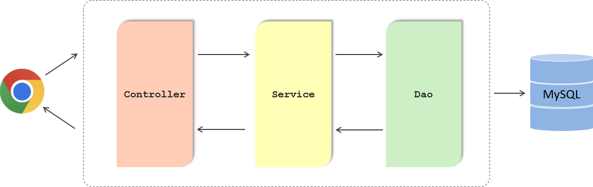

> 在三层架构当中，前端发起请求首先会到达 Controller(不进行逻辑处理)，然后 Controller 会直接调用 Service 进行逻辑处理， Service 再调用 Dao 完成数据访问操作。

在执行具体的业务处理之前，需要去做一些通用的业务处理  
比如：进行统一的登录校验，进行统一的字符编码等这些操作时，就可以借助于 Javaweb 当中三大组件之一的过滤器 Filter 或者是 Spring 当中提供的拦截器 Interceptor 来实现。

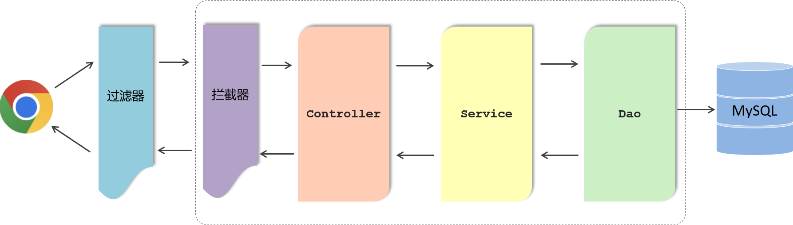

为了实现三层架构层与层之间的解耦，Spring 框架当中的第一大核心：IOC 控制反转与 DI 依赖注入。

> 控制反转，指的是将对象创建的控制权由应用程序自身交给外部容器，这个容器就是常说的 IOC 容器或 Spring 容器。
>
> DI 依赖注入指的是容器为程序提供运行时所需要的资源。

AOP 面向切面编程，还有 Spring 中的事务管理、全局异常处理器，以及传递会话技术 Cookie、Session 以及新的会话跟踪解决方案 JWT 令牌，阿里云 OSS 对象存储服务，以及通过 Mybatis 持久层架构操作数据库等技术。

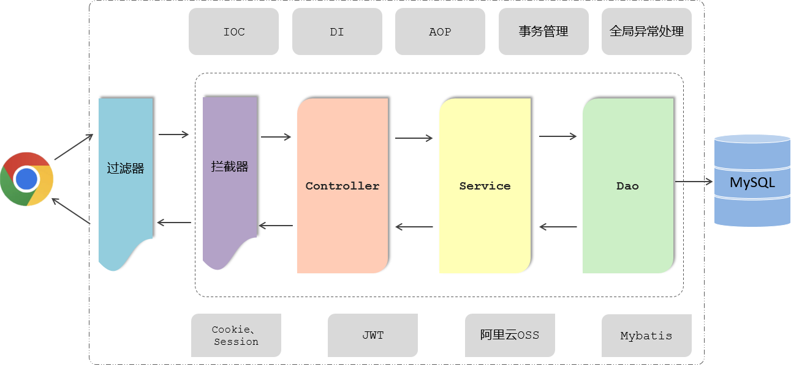

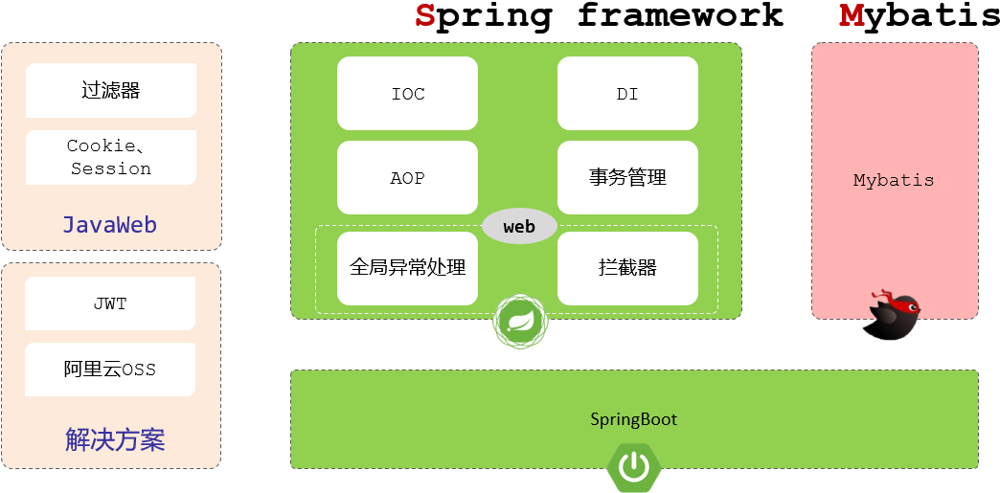

> Filter 过滤器、Cookie、 Session 这些都是传统的 JavaWeb 提供的技术。
>
> JWT 令牌、阿里云 OSS 对象存储服务，是现在企业项目中常见的一些解决方案。
>
> IOC 控制反转、DI 依赖注入、AOP 面向切面编程、事务管理、全局异常处理、拦截器等，这些技术都是 Spring Framework 框架当中提供的核心功能。
>
> Mybatis 就是一个持久层的框架，是用来操作数据库的。

在 Spring 框架的生态中，对 web 程序开发提供了很好的支持，如：全局异常处理器、拦截器这些都是 Spring 框架中 web 开发模块所提供的功能，而 Spring 框架的 web 开发模块，我们也称为：SpringMVC

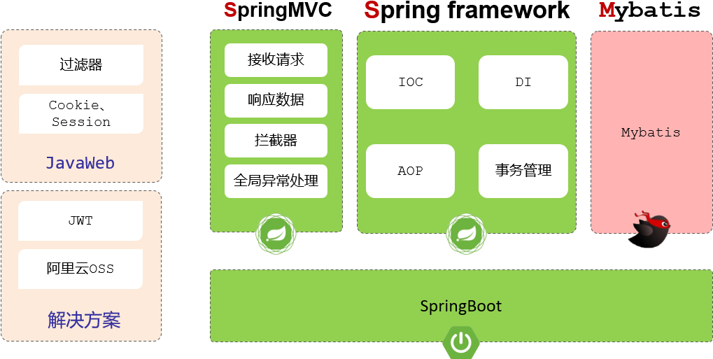

> SpringMVC 不是一个单独的框架，它是 Spring 框架的一部分，是 Spring 框架中的 web 开发模块，是用来简化原始的 Servlet 程序开发的。

外界俗称的 SSM，就是由：SpringMVC、Spring Framework、Mybatis 三块组成。

基于传统的 SSM 框架进行整合开发项目会比较繁琐，而且效率也比较低，所以在现在的企业项目开发当中，基本上都是直接基于 SpringBoot 整合 SSM 进行项目开发的。
