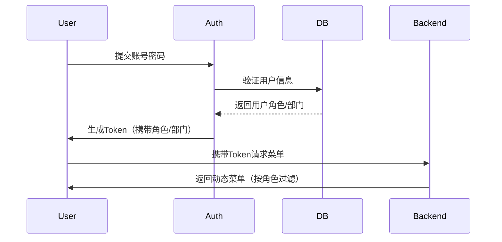
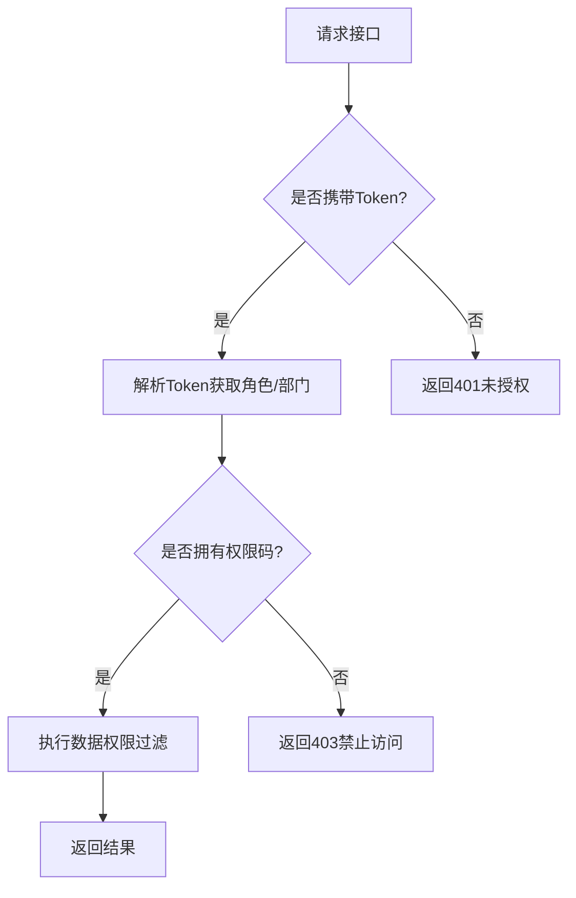

# 权限设计

#### **1. 权限模型设计**

采用 **`RBAC`（基于角色的访问控制）** 模型，结合 **功能权限** 和 **数据权限** 设计，确保灵活性和安全性。

#### **2. 核心模块功能**

|     模块     |                            功能描述                            |
| :----------: | :------------------------------------------------------------: |
| **菜单管理** |      动态配置后台菜单可见性（按角色控制）和菜单层级结构。      |
| **用户管理** |     管理用户账号、分配角色、关联部门，支持批量导入/导出。      |
| **部门管理** | 定义组织架构树（父子部门）、设置部门负责人，用于数据权限隔离。 |
| **角色管理** |   定义角色（管理员/查看者/编辑者），绑定功能权限和数据权限。   |

#### **3. 角色权限划分**

|    角色    |                                                     权限范围                                                     |
| :--------: | :--------------------------------------------------------------------------------------------------------------: |
| **管理员** |                    - 所有模块的完全控制权（增删改查） - 可分配角色、管理部门、配置全局菜单。                     |
| **编辑者** | - 用户管理：仅编辑本部门用户（不可删除/分配角色） - 菜单管理：不可操作 - 部门管理：仅查看 - 角色管理：不可操作。 |
| **查看者** |                        - 所有模块仅查看权限（不可增删改） - 菜单仅展示已授权的可见页面。                         |

#### **4. 功能权限设计**

##### **4.1 功能权限标识**

为每个操作定义唯一权限码（如 `user:add`, `menu:edit`），角色绑定权限码集合。

|   模块   |                     权限码示例                      |        说明        |
| :------: | :-------------------------------------------------: | :----------------: |
| 用户管理 | [{`authCode`:`user:add`} `{authCode: user:delete`}] | 新增、删除用户权限 |
| 部门管理 | [{`authCode`:`dept:view`} `{authCode: dept:edit`}]  |   查看或编辑部门   |
| 菜单管理 |            [{`authCode`:`menu:config `}]            |   配置菜单可见性   |
| 角色管理 |            [{`authCode`: `role:assign`}]            |    分配角色权限    |

##### **4.2 权限分配示例**

|  角色  |               权限码集合                |
| :----: | :-------------------------------------: |
| 管理员 |          `all`（表示所有权限）          |
| 编辑者 | [`user:edit`, `dept:view`, `menu:view`] |
| 查看者 | [`user:view`, `dept:view`, `menu:view`] |

#### **5. 数据权限设计**

基于 **部门树** 控制数据可见性：

- **用户管理**：编辑者仅能管理本部门用户，管理员可跨部门操作。
- **部门数据隔离**：用户仅能查看本部门及子部门数据（需支持递归查询）。

#### **6. 菜单动态渲染**

1. **菜单可见性**：根据角色权限码动态过滤菜单（如 `menu:view` 权限可访问菜单）。
2. **菜单层级**：支持多级嵌套（父子菜单），通过部门或角色绑定可见范围。

#### **7. 关键流程设计**

##### **7.1 用户登录流程**



##### **7.2 权限校验流程**



#### **8. 数据库表设计**

```sql
-- 用户表
CREATE TABLE user (
  id INT PRIMARY KEY,
  name VARCHAR(50),
  dept_id INT,        -- 关联部门
  role_id INT         -- 关联角色
);

-- 部门表
CREATE TABLE dept (
  id INT PRIMARY KEY,
  name VARCHAR(50),
  parent_id INT       -- 父部门ID
);

-- 角色表
CREATE TABLE role (
  id INT PRIMARY KEY,
  name VARCHAR(20),   -- 角色名称（管理员/编辑者/查看者）
  permissions JSON    -- 权限码集合（如 ["user:add", "dept:edit"]）
);

-- 菜单表
CREATE TABLE menu (
  id INT PRIMARY KEY,
  name VARCHAR(50),
  path VARCHAR(100),  -- 路由路径
  parent_id INT,      -- 父菜单ID
  required_permission VARCHAR(50) -- 所需权限码（如 "menu:view"）
);
```

此方案兼顾灵活性与安全性，通过 **`RBAC` + 部门隔离** 实现精细化权限管理，适用于中小型企业管理后台场景。
