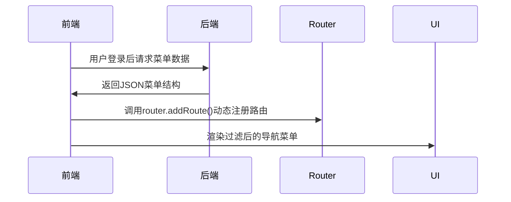

# 前端权限方案

#### **一、后端访问控制与按钮细粒度权限实现文档**

#### **一、后端访问控制实现方案**

##### **1. 核心实现原理**

- **动态路由生成**：通过后端接口返回菜单数据结构，前端解析后动态注册路由。
- **权限模式配置**：使用 `accessMode='backend'` 启用后端控制模式。
- **数据结构规范**：后端需返回符合约定的嵌套菜单结构（包含路由路径、组件映射、权限标识）。

##### **2. 技术流程**



##### **3. 配置步骤**

1. **启用后端控制模式**
   修改 `preferences.ts` 配置：

   ```typescript
   // src/config/preferences.ts
   import { defineOverridesPreferences } from '@vben/preferences';
   
   export const overridesPreferences = defineOverridesPreferences({
     app: {
       accessMode: 'backend', // 确保模式设置为后端
     },
   });
   ```

**对接后端菜单接口**

在 `src/router/access.ts` 中定义菜单获取逻辑：

```typescript
// src/router/access.ts
async function generateAccess(options: GenerateMenuAndRoutesOptions) {
  return await generateAccessible(preferences.app.accessMode, {
    fetchMenuListAsync: async () => {
      return await getAllMenus(); // 调用后端菜单API
    },
  });
}
```

1. **数据结构规范示例**
   后端返回的菜单需包含 ​**路由路径**、**组件映射** 和 ​**权限元数据**：

   ```typescript
   // 示例数据 (需与后端约定一致)
   const menuData = [
     {
       component: 'BasicLayout', // 布局组件固定名称
       name: 'Dashboard',
       path: '/',
       meta: { title: '仪表盘', order: -1 },
       children: [
         {
           name: 'Analytics',
           path: '/analytics',
           component: '/dashboard/analytics/index', // 映射src/views目录下的Vue文件
           meta: { 
             title: '分析页', 
             permissionCode: 'PAGE_ANALYTICS_VIEW' // 页面级权限标识
           }
         }
       ]
     }
   ];
   ```

##### **4. 关键限制与说明**

- **组件路径转换规则**：`component` 字段需去除 `views/` 前缀和 `.vue` 后缀（如 `/dashboard/analytics/index` 对应 `src/views/dashboard/analytics/index.vue`）。
- **根布局固定**：顶级菜单必须使用 `component: 'BasicLayout'` 确保整体布局。
- **错误处理**：若数据结构不合法，前端将无法渲染导航菜单。

#### **二、按钮细粒度权限控制方案**

##### **1. 权限码管理流程**

1. **权限码获取**
   用户登录后，前端调用接口获取权限码列表：

```typescript
// src/store/auth.ts
const [userInfo, accessCodes] = await Promise.all([
  fetchUserInfo(),    // 获取用户信息
  getAccessCodes(),   // 获取权限码列表
]);
accessStore.setAccessCodes(accessCodes); // 存储权限码
```

1. **权限码数据结构**
   后端返回字符串数组格式：

   ```json
   ["BTN_USER_ADD", "BTN_USER_DELETE", "PAGE_REPORT_VIEW"]
   ```

### 后端访问控制与按钮细粒度权限实现文档

------

#### **一、后端访问控制实现方案**

##### **1. 核心实现原理**

- **动态路由生成**：通过后端接口返回菜单数据结构，前端解析后动态注册路由。
- **权限模式配置**：使用 `accessMode='backend'` 启用后端控制模式。
- **数据结构规范**：后端需返回符合约定的嵌套菜单结构（包含路由路径、组件映射、权限标识）。

##### **2. 技术流程**


##### **3. 配置步骤**

1. **启用后端控制模式**
   修改 `preferences.ts` 配置：

   typescript

   ```typescript
   // src/config/preferences.ts
   import { defineOverridesPreferences } from '@vben/preferences';
   
   export const overridesPreferences = defineOverridesPreferences({
     app: {
       accessMode: 'backend', // 确保模式设置为后端
     },
   });
   ```

2. **对接后端菜单接口**
   在 `src/router/access.ts` 中定义菜单获取逻辑：

   typescript

   ```typescript
   // src/router/access.ts
   async function generateAccess(options: GenerateMenuAndRoutesOptions) {
     return await generateAccessible(preferences.app.accessMode, {
       fetchMenuListAsync: async () => {
         return await getAllMenus(); // 调用后端菜单API
       },
     });
   }
   ```

3. **数据结构规范示例**
   后端返回的菜单需包含 ​**路由路径**、**组件映射** 和 ​**权限元数据**：

   typescript

   ```typescript
   // 示例数据 (需与后端约定一致)
   const menuData = [
     {
       component: 'BasicLayout', // 布局组件固定名称
       name: 'Dashboard',
       path: '/',
       meta: { title: '仪表盘', order: -1 },
       children: [
         {
           name: 'Analytics',
           path: '/analytics',
           component: '/dashboard/analytics/index', // 映射src/views目录下的Vue文件
           meta: { 
             title: '分析页', 
             permissionCode: 'PAGE_ANALYTICS_VIEW' // 页面级权限标识
           }
         }
       ]
     }
   ];
   ```

##### **4. 关键限制与说明**

- **组件路径转换规则**：`component` 字段需去除 `views/` 前缀和 `.vue` 后缀（如 `/dashboard/analytics/index` 对应 `src/views/dashboard/analytics/index.vue`）。
- **根布局固定**：顶级菜单必须使用 `component: 'BasicLayout'` 确保整体布局。
- **错误处理**：若数据结构不合法，前端将无法渲染导航菜单。

------

#### **二、按钮细粒度权限控制方案**

##### **1. 权限码管理流程**

1. **权限码获取**
   用户登录后，前端调用接口获取权限码列表：

   typescript

   ```typescript
   // src/store/auth.ts
   const [userInfo, accessCodes] = await Promise.all([
     fetchUserInfo(),    // 获取用户信息
     getAccessCodes(),   // 获取权限码列表
   ]);
   accessStore.setAccessCodes(accessCodes); // 存储权限码
   ```

2. **权限码数据结构**
   后端返回字符串数组格式：

   json

   ```json
   ["BTN_USER_ADD", "BTN_USER_DELETE", "PAGE_REPORT_VIEW"]
   ```

##### **2. 前端控制实现**

- **组件指令控制**：使用 `v-access:code` 指令绑定权限码

  vue

  ```vue
  <template>
    <!-- 单个权限码控制 -->
    <button v-access:code="'System:User:Edit'">编辑用户</button>
  
    <!-- 多权限码联合控制（OR逻辑） -->
    <button v-access:code="['Admin', 'System:User:Edit']">管理员操作</button>
  </template>
  ```

- **逻辑层校验**：通过 `useAccess` 钩子编程式控制

  ```typescript
  import { useAccess } from '@vben/access';
  
  const { hasAccess } = useAccess();
  
  if (hasAccess('System:User:Export')) {
    // 执行导出操作
  }
  ```

##### **3. 权限标识设计建议**

| 权限类型 |          命名规范          |        示例        |
| :------: | :------------------------: | :----------------: |
| 页面访问 |  `{父模块}{子模块}: List`  | `System:User:List` |
| 按钮操作 | `{父模块}{子模块}: Action` | `System:User:Add`  |

#### **三、注意事项与最佳实践**

1. **菜单数据校验**

   - 后端需确保返回的 `component` 路径在前端存在对应`Vue`文件。
   - 使用开发环境工具校验数据结构（如 Postman 自动化测试）。

2. **权限码同步更新**

   - 当用户权限变更时，需强制退出重新登录或调用 `refreshAccess` 方法。

3. **安全增强措施**

   - 敏感操作（如删除）需在后端二次校验权限，避免前端绕过。

4. **性能优化**

   - 菜单数据缓存至本地存储（`LocalStorage`），减少重复请求。

   - 使用路由懒加载提升动态路由性能：

     ```typescript
     component: () => import('@/views/dashboard/analytics/index.vue')
     ```
